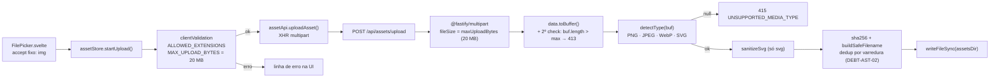
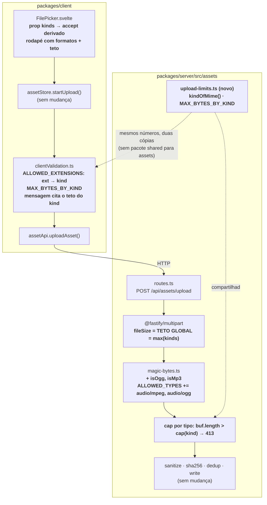

# Design — arquitetura · wi-mapa-som-01

**Item:** Upload aceita mp3 e ogg, com teto de tamanho por tipo
**Marco:** M3 — Som ambiente sincronizado (plano `pln-mapa-som`)
**Data:** 2026-08-07
**Par:** `.esteira/design/wi-mapa-som-01-mockup.md`

---

## 1. A cadeia de upload, como ela é hoje



O áudio morre em **`detectType`** (415), não no disco. E morreria antes disso se
passasse de 20 MB.

## 2. A cadeia depois deste item

Em **negrito** o que muda. Nada fora da caixa de assets é tocado.



### A inversão que dá nome ao item

O teto **por tipo** só pode ser cobrado **depois** de saber o tipo — e o tipo só
é conhecido depois de `detectType`, que é depois de ter os bytes. Daí a ordem
nova:

```
multipart (teto GLOBAL, cego ao tipo)
      ↓
toBuffer
      ↓
detectType  ────────► 415 se não reconhecer
      ↓  (mime conhecido)
kindOfMime(mime) → "image" | "audio"
      ↓
buf.length > MAX_BYTES_BY_KIND[kind] ────────► 413 com a mensagem DO TIPO
      ↓
segue o fluxo que já existe
```

O `fileSize` do multipart deixa de ser "o limite" e passa a ser **o teto de
todos os tetos** (o maior dos kinds). Ele continua sendo a proteção que corta o
stream antes de estourar a memória; o cap por tipo é quem devolve a mensagem
útil.

**Consequência a assumir de olho aberto:** um PNG de 90 MB agora é lido inteiro
para a memória (`toBuffer`) antes de ser rejeitado por 413, porque o multipart
só corta em 100 MB. Antes, morria em 20 MB. Em servidor local de uma mesa, com
`role >= TRUSTED` para subir, é um custo aceitável — e é o preço de ter cap por
tipo com uma rota única. A alternativa (rota separada por tipo, ou limite
dinâmico por header declarado) custa mais do que resolve neste marco.

## 3. Magic bytes — o que entra e o que fica de fora

| Formato | Assinatura | Entra? |
|---|---|---|
| OGG | `4F 67 67 53` (`OggS`), bytes 0–3 | **Sim** — sem conflito com nada da lista |
| MP3 com tag ID3 | `49 44 33` (`ID3`), bytes 0–2 | **Sim** |
| MP3 sem tag (frame sync) | `FF` + `Ex`/`Fx` (byte 1 com os 3 bits altos ligados: `b1 & 0xE0 === 0xE0`) | **Sim** |
| WAV | `RIFF` (0–3) + `WAVE` (8–11) | **Não** — fora do escopo do item |

Duas armadilhas que o Plano já tinha nomeado, resolvidas aqui:

1. **RIFF é ambíguo.** WAV e WebP começam iguais nos bytes 0–3; só os bytes 8–11
   separam (`WEBP` vs `WAVE`). Aceitar WAV obrigaria a mexer no `isWebp`, que
   hoje já checa 8–11 corretamente — mudança de risco desnecessária para um
   formato que o item não pede. WAV **fora**, por decisão, não por esquecimento.
2. **`FF` do MP3 vs `FF D8 FF` do JPEG.** Não colidem: `0xD8 & 0xE0 = 0xC0`, e o
   frame sync exige `0xE0`. Ainda assim, `isJpeg` continua sendo avaliado
   **antes** de `isMp3` em `detectType` — ordem defensiva, custo zero.
   `isSvg` permanece por último (é o único heurístico por texto).

## 4. Os números moram em dois lugares — e isso é decisão, não descuido

Não existe pacote compartilhado para a caixa de assets: o servidor resolve
`@fusion/shared` por `node_modules/dist`, o cliente por alias do Vite, e nada de
assets vive em `shared/`. Promover os limites para `@fusion/shared` só por duas
constantes puxa a ordem de build para dentro de um item pequeno.

**Decisão:** duplicar os números, com o servidor como autoridade declarada em
comentário nos dois arquivos, e um teste que trava a divergência sendo óbvia
(ver §6). Se a lista de formatos crescer de novo (vídeo, fontes), aí sim vale
subir para `shared/`.

| | Servidor | Cliente |
|---|---|---|
| Arquivo | `packages/server/src/assets/upload-limits.ts` (novo) | `packages/client/src/lib/assets/clientValidation.ts` |
| Papel | **autoridade** — 413/415 reais | antecipação de UX; nunca segurança |
| Chave | mime detectado → kind | extensão do nome → kind |

## 5. Superfície de mudança — arquivo por arquivo

| Arquivo | O que acontece |
|---|---|
| `server/src/assets/upload-limits.ts` | **novo** — `AssetKind`, `MAX_BYTES_BY_KIND`, `kindOfMime()`, `MAX_UPLOAD_BYTES_GLOBAL` |
| `server/src/assets/magic-bytes.ts` | `+ isOgg`, `+ isMp3`, `ALLOWED_TYPES += audio/mpeg → .mp3`, `audio/ogg → .ogg`; `detectType` chama os dois |
| `server/src/assets/routes.ts` | default do `maxUploadBytes` passa a ser o teto global; cap por tipo **após** `detectType`; mensagem do 413 cita o tipo |
| `server/src/assets/index.ts` | reexporta o módulo novo |
| `client/src/lib/assets/clientValidation.ts` | `ALLOWED_EXTENSIONS` vira `ext → kind`; `MAX_BYTES_BY_KIND`; `validateFileForUpload` usa o cap do kind; `MAX_UPLOAD_BYTES` mantido como alias do teto de imagem (há teste que o lê) |
| `client/src/lib/assets/index.ts` | reexporta o que for novo |
| `client/src/components/assets/FilePicker.svelte` | prop `kinds` (default `["image"]`, preserva chamadores atuais) → `accept` e rótulo derivados; rodapé com formatos + teto |
| `server/src/boot.ts` | **não muda** — nunca passou `maxUploadBytes`, herda o novo default |

Fora de escopo, confirmado por leitura: `guessMime()` já mapeia `.mp3`/`.ogg`,
`isImageExtension()` já devolve `false` para eles, e o `asset-card` já desenha
`♫` para `mime_type.startsWith("audio/")`. A grid e o serving **não precisam de
mudança nenhuma**.

## 6. Onde a verificação tem que morder (insumo para Implementar/Validar)

Não é o plano de testes — é onde o desenho pode estar errado e ninguém perceber:

- **415 → 201 para mp3/ogg reais** (bytes de verdade, não string fake), nas duas
  variantes de MP3: com `ID3` e com frame sync puro.
- **WAV continua 415**, e **WebP continua 201** — a mesma fixture RIFF prova as
  duas pontas.
- **413 por tipo**: áudio de 21 MB **passa** (era erro antes deste item) e imagem
  de 21 MB **falha** — este par é o item inteiro em dois testes.
- **`assets.test.ts:246` passa `maxUploadBytes: 1024*1024`** — o contexto de
  teste sobrescreve o teto global. Se o cap por tipo for cobrado sem respeitar o
  override, esse arquivo quebra; se for cobrado só pelo override, o cap por tipo
  não é testado. Os dois caminhos precisam existir de propósito.
- **`clientValidation.test.ts:105` afirma `formatBytes(MAX_UPLOAD_BYTES) === "20.0 MB"`** —
  manter `MAX_UPLOAD_BYTES` como o teto de **imagem** mantém esse teste honesto.
- **Mutação que precisa ficar vermelha:** remover a checagem de cap por tipo e
  deixar só o teto global. Se a suíte continuar verde, o item não foi testado.

## 7. O que este desenho deliberadamente não resolve

- **DEBT-AST-02** (dedup por varredura O(n)): uma biblioteca de músicas tem
  dezenas de arquivos, não milhares. Fica registrado, não fica corrigido.
- **Duração do áudio** (`duration_ms` da spec 20): exigiria decodificar no
  upload. O player do M3 não precisa dela.
- **Thumbnail/waveform de áudio**: questão em aberto da própria spec 20.
- **`accept` dos chamadores atuais**: cena e token continuam só imagem — quem
  monta o picker de áudio é o item seguinte do M3.
