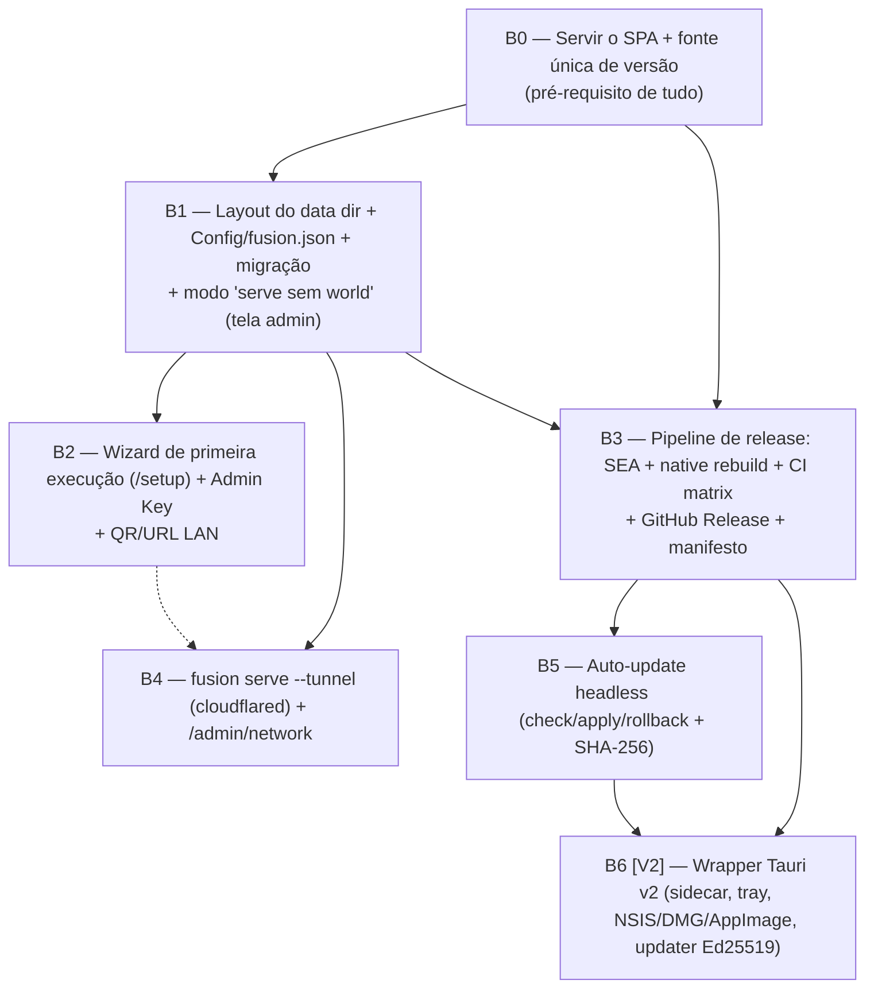

# M6 — Distribuição (design arquitetural)

- **Status:** design v1 (pré-implementação)
- **Data:** 2026-07-01
- **Autor:** design pré-batch M6
- **Escopo:** empacotamento do servidor, auto-update, túnel WAN, wrapper Tauri, plano de batches, riscos.
- **Fontes normativas:** `specs/22-instalacao-e-distribuicao.md` (REQ-DST), `specs/27-roadmap-e-milestones.md` (M6, Q-RDM-04), `docs/research/92-install-distribution-autoupdate.md`.
- **Regra:** este documento **desenha**; não implementa. Onde diverge das decisões antigas de `22`/`92`, a divergência é explícita e justificada com o estado real do código.

> **Princípio-guia (experiência-alvo).** "O GM baixa **1 arquivo**, dá dois cliques, responde um wizard curto no navegador e manda um link para os jogadores." Todo trade-off abaixo é resolvido a favor dessa frase. Jogadores nunca instalam nada.

---

## 0. Estado atual do código (baseline para o M6)

Levantado do repo em 2026-07-01 (branch `build/app`). É o ponto de partida real, não o que as specs assumem.

| Fato observado                                                                                                                                       | Arquivo                                                                | Implicação para M6                                                                                                                                      |
| ---------------------------------------------------------------------------------------------------------------------------------------------------- | ---------------------------------------------------------------------- | ------------------------------------------------------------------------------------------------------------------------------------------------------- | -------------------------------------- | ---------------------------------------------------------------------------------------------------------------------------- |
| **Dois** addons nativos, não um: `better-sqlite3` **e** `@node-rs/argon2`                                                                            | `packages/server/package.json`                                         | O empacotamento tem de resolver **dois** `.node`, não só o SQLite. Isto derruba a premissa "sidecar JS puro" de `92`/`22`.                              |
| `better-sqlite3` é usado em profundidade: WAL, `PRAGMA integrity_check`, **online backup API** (`db.backup()`), migrations versionadas, process-lock | `worlds/world-manager.ts`, `db/*`                                      | "Mover SQLite para Rust" (recomendação de `92`/DEC-DST-03) reescreveria WorldManager, migrations e backup inteiros. **Rejeitado** (ver §1.4).           |
| Data dir default = `~/.fusion`; config = `fusion.json` **na raiz** do data dir                                                                       | `packages/server/src/config.ts`                                        | Diverge de REQ-DST-008 (`Documents/FusionVTT`) e REQ-DST-007 (`Config/fusion.json`). M6 precisa migrar o layout (§1.5).                                 |
| Layout de world: `<dataDir>/worlds/<slug>/{world.db,assets,backups,world.json,world.lock}`                                                           | `world-manager.ts`                                                     | Já compatível com REQ-DST-007. Só falta subir uma pasta de nível (`Config/`, `Logs/`, `assets/` global, `systems/`).                                    |
| O servidor **ainda não serve o SPA**: `boot.ts` registra só `/health` + rotas de auth/asset; SPA é servido pelo Vite dev                             | `boot.ts` (TODO M1-A), `packages/client` tem `dist/` mas não é servido | REQ-DST-002 (client embutido no executável) é **trabalho novo** e é pré-requisito de qualquer executável distribuível. Vira um batch dedicado (§5, B0). |
| CLI atual: `serve`, `world list                                                                                                                      | create                                                                 | backup`, `user add`. `serve`aceita`--port --data-dir --log-level --world`                                                                               | `cli/args.ts`, `cli/commands/serve.ts` | Falta `--tunnel`, wizard de setup, `/setup`, checagem de update. `serve` abre **um** world via `--world` (multi-world é V2). |
| `serve` só sobe HTTP+socket se `--world` for passado; sem world, sobe só `/health`                                                                   | `cli/commands/serve.ts`                                                | O modo "servidor de gerência sem world aberto" (tela admin/setup) ainda não existe. Necessário para o wizard (§4 / B1).                                 |
| Sem git remote configurado; CI é 1 job Ubuntu-only (`ci.yml`)                                                                                        | `.github/workflows/ci.yml`                                             | O `{owner}/fusion` das URLs de update é **indefinido**. Release matrix multi-OS é trabalho novo (§5, B3). Decisão em aberto DA-01.                      |
| `version` hardcoded `"0.1.0"` em 3 lugares (`boot.ts` /health, `world-manager.ts`, package.json)                                                     | vários                                                                 | M6 precisa de **uma** fonte de versão (§2.4).                                                                                                           |

**Consequência central:** as decisões DEC-DST-02 (`@yao-pkg/pkg`) e DEC-DST-03 (SQLite→Rust) de `specs/22` foram tomadas em 2026-06-11 **antes** deste código existir e **antes** de o segundo addon (`@node-rs/argon2`) entrar. Este documento as **re-avalia** (§1) e propõe uma decisão atualizada, mantendo `22` como spec e registrando a mudança como decisão de design de M6.

---

## 1. Executável do servidor

### 1.1 Requisito e restrição

- REQ-DST-001: executáveis autocontidos p/ Windows x64, macOS x64, macOS arm64, Linux x64. **Windows x64 primeiro**; os demais não podem ser fechados por decisões de design.
- REQ-DST-002: client (`packages/client/dist`) embutido/servido pelo executável.
- REQ-DST-046: ≤ 150 MB por plataforma. REQ-DST-047: primeira resposta HTTP < 5 s.
- **Restrição dura:** dois módulos nativos (`better-sqlite3`, `@node-rs/argon2`). Nenhuma ferramenta de bundling embute `.node` **dentro** de um binário; o `.node` sempre acaba como arquivo ao lado (VFS não cobre `dlopen`). Todas as opções abaixo giram em torno de "como entregar o `.node` sem o GM perceber".

### 1.2 Opções avaliadas

| Estratégia                                                               | Como lida com `.node`                                                                                          | 1 arquivo?                                                                   | Cross-compile                                                              | Node embutido                  | Licença                                                                  | Veredito                                                          |
| ------------------------------------------------------------------------ | -------------------------------------------------------------------------------------------------------------- | ---------------------------------------------------------------------------- | -------------------------------------------------------------------------- | ------------------------------ | ------------------------------------------------------------------------ | ----------------------------------------------------------------- |
| **A. Node SEA** (`--experimental-sea-config`, Node 22 LTS estável)       | `.node` fica externo; SEA + assets do client via `sea.getAsset()`; addons carregados de caminho ao lado do exe | Não puro (exe + pasta `native/`) — resolver com self-extract ou zip portátil | Não (precisa do `node` binário de cada alvo; roda a montagem em CI matrix) | Sim (o `node` host vira o exe) | MIT (Node)                                                               | **Recomendado** — oficial, sem dep de 3os, futuro-seguro          |
| **B. `@yao-pkg/pkg`** (fork ativo do vercel/pkg) — escolha de DEC-DST-02 | `.node` externo em `resources/`, resolvido por `process.execPath`                                              | Não puro (mesmo problema)                                                    | Sim (targets num comando)                                                  | Sim (snapshot V8)              | MIT, mas projeto é **fork** de um projeto arquivado; risco de manutenção | **Fallback** — só se SEA travar em algum alvo                     |
| C. `nexe`                                                                | igual a B                                                                                                      | Não                                                                          | Parcial                                                                    | Sim                            | MIT, manutenção intermitente                                             | Rejeitado (menos ativo que B)                                     |
| D. esbuild bundle + exigir Node instalado (`npx fusion-server`)          | trivial (usa Node do usuário)                                                                                  | Não — exige Node no PATH                                                     | n/a                                                                        | Não                            | —                                                                        | Rejeitado — quebra "GM não-técnico baixa 1 arquivo" (REQ-DST-001) |
| E. Instalador que carrega runtime (MSI que instala Node)                 | trivial                                                                                                        | Não — vira instalador pesado                                                 | n/a                                                                        | Sim                            | —                                                                        | Rejeitado no MVP headless; é o caminho V2/Tauri                   |

### 1.3 Decisão recomendada — **DEC-M6-01: Node SEA como primário, `@yao-pkg/pkg` como fallback**

**Muda DEC-DST-02** (que fixava `@yao-pkg/pkg`). Razão da mudança desde 2026-06-11:

1. **SEA amadureceu.** No Node 22 LTS o Single Executable Application saiu de experimental para caminho suportado; `sea.getAsset()`/`getRawAsset()` cobrem o embed do `packages/client/dist` (REQ-DST-002) sem VFS de terceiros.
2. **`@yao-pkg/pkg` é um fork.** Depender de um fork de projeto arquivado para o **único** caminho de distribuição é risco de sustentação — exatamente o tipo de dependência que o CLAUDE.md manda justificar. SEA é upstream, sem dependência nova.
3. **O problema do `.node` é idêntico nas duas.** Nenhuma embute o addon; então a vantagem de `pkg` (bundle "mágico") não se aplica ao nosso caso — os dois módulos nativos saem para uma pasta `native/` de qualquer jeito. Escolhemos a opção sem dep externa.

**Formato de entrega para satisfazer "1 arquivo":** como o `.node` precisa ficar ao lado, o artefato entregue é **um único arquivo self-extracting/portátil**:

- **Windows (primário):** `fusion-server-<versão>-windows-x64.exe` é o SEA; os dois `.node` + client assets viajam **dentro** do próprio exe quando possível (client via SEA assets) e, para os `.node`, um de dois caminhos:
  - **1a (preferido):** exe stub que, na primeira execução, extrai `better_sqlite3.node` e `argon2.node` para `<dataDir>/runtime/<versão>/` e faz `require` de lá. "1 arquivo" para o GM; a pasta `runtime/` é cache interno, versionada, recriável.
  - **1b (fallback):** distribuir um `.zip` portátil (`fusion-server-<versão>-windows-x64.zip`) com `fusion-server.exe` + pasta `native/`. Ainda é "baixar, extrair, dois cliques". Aceitável se 1a se mostrar frágil no antivírus.
- **Linux:** AppImage (empacota exe + `native/` num só arquivo montável) — resolve o "1 arquivo" nativamente. `chmod +x && ./fusion-*.AppImage`.
- **macOS:** `.app` dentro de `.dmg` (a pasta `Contents/` acomoda os `.node`). Notarização entra com o signing (§6).

> **Compilação dos `.node` por plataforma/arch.** Cada `.node` é específico de `(SO, arch, ABI do Node)`. A matrix de CI (§5 B3) roda em `windows-latest`, `macos-latest` (x64+arm64), `ubuntu-22.04`, e em cada runner faz `pnpm rebuild better-sqlite3 @node-rs/argon2` **contra o Node 22 alvo** antes de montar o SEA. `@node-rs/argon2` publica prebuilds por alvo (napi-rs), o que reduz risco; `better-sqlite3` usa prebuild-install. **Nenhum cross-compile de addon** — cada alvo é montado no seu próprio runner nativo (macOS arm64 via runner Apple Silicon do GitHub).

### 1.4 Por que NÃO mover o SQLite para Rust agora (contraria a recomendação de `92` e DEC-DST-03)

`92` e DEC-DST-03 recomendam eliminar o addon movendo SQLite para `tauri-plugin-sql`. **Rejeitado para o MVP de M6** porque:

- O servidor headless (o artefato que M6 precisa entregar **primeiro**) **não tem Tauri**. `tauri-plugin-sql` só existe dentro do Rust do Tauri. Adotá-lo obrigaria a acoplar toda a persistência ao wrapper — invertendo a ordem (headless antes de Tauri) que a própria `27`/DoD-M6 pede.
- Reescreveria `WorldManager` (lock, integrity, recovery), `db/migrations`, e principalmente a **online backup API** (`db.backup()`) da qual dependem REQ-OPS-005 e o backup pré-update (REQ-DST-022). É semanas de trabalho de altíssimo risco para **remover um addon que o SEA já sabe carregar de arquivo**.
- `@node-rs/argon2` continuaria sendo addon nativo de qualquer forma. Mover só o SQLite não elimina o problema "tem `.node` ao lado" — então não compra a simplificação prometida.

**Registro:** DEC-M6-01 **substitui** DEC-DST-03 no escopo do executável headless. A ideia "SQLite em Rust" fica **[V2] condicional**: só reconsiderar se, ao integrar o Tauri (§4), o carregamento dos dois `.node` como sidecar-resource se mostrar inviável na prática. Alternativa mais barata que Rust, se algum dia o addon incomodar: avaliar `node:sqlite` (built-in do Node 22.5+) — mas isso é outra migração e **não é** requisito de M6.

### 1.5 Onde vivem worlds/assets/config — layout do usuário e migração

**Layout-alvo (REQ-DST-007/008), com `{dataDir}` gravável:**

```
{dataDir}/                         # ver defaults abaixo
├── Config/
│   └── fusion.json                # config do servidor (hoje está na RAIZ — migrar)
├── worlds/<slug>/{world.db, assets/, backups/, world.json, world.lock}   # JÁ existe assim
├── systems/                       # sistemas instalados (cópias no MVP)
├── assets/                        # uploads globais
├── backups/                       # backups pre-event globais (update/migração)
├── runtime/<versão>/              # NOVO: cache dos .node extraídos (interno, recriável)
└── Logs/{fusion-<date>.log, error.log, audit.log, diagnostics.json}
```

**Defaults por SO (REQ-DST-008), substituindo `~/.fusion`:**

- Windows: `%USERPROFILE%\Documents\FusionVTT`
- macOS: `~/Documents/FusionVTT`
- Linux: `~/FusionVTT` (ou `$XDG_DATA_HOME/FusionVTT` se definido — recomendação de conforto)

**Modo portátil (REQ-DST-009):** `--data-dir <path>` já existe no CLI; adicionar botão "Usar pasta portátil" no wizard que grava `<exeDir>/FusionVTT-Data`.

**Migração do layout atual (trabalho de M6, batch B1):**

1. `config.ts`: trocar o default de `~/.fusion` pela função `resolveDefaultDataDir(os)` acima. Manter `~/.fusion` como **fallback de leitura** por 1 versão (se existir e o novo não, usar o antigo e logar aviso de migração).
2. `config.ts` `readFusionJson`: procurar `Config/fusion.json` **e** (fallback) `fusion.json` na raiz; se achar só o antigo, mover para `Config/` na primeira escrita. Sem quebrar mundos existentes.
3. Estender o `FusionConfig` para o schema completo de REQ-DST (campos `serverVersion`, `dataVersion`, `adminPasswordHash`, `jwtHmacSecret`, `updateChannel`, `setupCompleted`, `allowedOrigins`, proxy, `upnpEnabled`). O schema atual (`ServerConfigSchema`) cobre porta/host/dataDir/logLevel/cookies/proxy parciais — é um superset a construir, não do zero.
4. `dataVersion` + migrations do **data directory** (distinto das migrations do `world.db`): um índice simples de migração inline (Q-DST-04 resolve a favor de "inline no código com `dataVersion`", suficiente para MVP — não criar sistema formal de scripts).

---

## 2. Auto-update

### 2.1 Estratégia MVP (headless): download assistido, não silencioso

Alinhado a REQ-DST-019..025. **Sem updater automático no headless**; consentimento explícito do GM. Mecanismo:

1. **Checagem** (REQ-DST-019/020): no boot e sob demanda em `/admin/update/check`, GET em `https://api.github.com/repos/{owner}/fusion/releases/latest` (ou `.../releases` filtrando por canal). **Não-bloqueante**: falha de rede/rate-limit não impede o boot; só marca "não verificado".
2. **Notificação** (REQ-DST-021): se `latest > serverVersion`, exibir na tela admin (e evento WS `server.update_available` só para GM). **Nunca** baixar sem clique do GM.
3. **Backup pré-update** (REQ-DST-022): antes de aplicar, `db.backup()` de cada world aberto → `worlds/<slug>/backups/pre-event-update-<versão>-<ISO>.db`. Confirmar ao GM que os snapshots existem. (Reusa a online-backup API já implementada — ver §1.4.)
4. **Aplicar** (REQ-DST-023/024): baixar binário para tmp → **verificar SHA-256** contra o valor do manifesto → renomear exe atual p/ `.bak` → substituir → reiniciar. Em falha: restaurar `.bak`, seguir na versão atual. No Windows, o exe em execução não pode se auto-sobrescrever: usar um **helper de swap** (script/relançador curto que roda após o processo principal sair) — padrão conhecido; documentar no batch.
5. **Canal** (REQ-DST-025): `updateChannel: "stable" | "dev"` em `Config/fusion.json`, default `stable`.

### 2.2 Integridade e assinatura

- **MVP headless:** integridade por **SHA-256** publicado no release (`UpdateManifest.platforms[*].sha256`). Suficiente contra corrupção/MITM de CDN quando o download vem por HTTPS do GitHub. **Sem** assinatura de código do binário nesta fase (ver §6/DA-02).
- **[V2] Tauri:** assinatura **Ed25519** obrigatória via `tauri-plugin-updater` (`tauri signer generate`), pubkey em `tauri.conf.json`, `.sig` por artefato. Isto é REQ-DST-026 e é o mecanismo definitivo.

### 2.3 Canal de distribuição

- **GitHub Releases** (gratuito, sem conta paga) hospeda binários + `latest-stable.json`/`latest-dev.json` (REQ-DST-027 gera no CI). Tag `v<semver>` dispara o release (REQ-DST-043).
- `UpdateManifest` conforme o modelo de dados de `specs/22` (version, releaseDate, releaseNotes, channel, platforms{url,sha256,size,signature?}).

### 2.4 Fonte única de versão (dívida a pagar em M6)

Hoje `"0.1.0"` está hardcoded em ≥3 lugares. Criar `packages/shared/src/version.ts` exportando `FUSION_VERSION` (lido do `package.json` no build, injetado como constante), consumido por `/health`, handshake WS (`serverVersion`, REQ-DST-036), `WorldManifest.fusionVersion` e a checagem de update. Sem isso o auto-update compara contra número errado.

### 2.5 O que fica [V2]

- Updater **silencioso/automático** (só Tauri, com Ed25519).
- Phased rollout, `version_comparator` p/ downgrade de emergência.
- `latest.json` no formato `{os}-{arch}-{installer}` do `tauri-action` ≥2.10.
- Delta updates.

---

## 3. Túnel WAN (expor a porta 33000 sem port-forward)

### 3.1 Critérios

Gratuito; **não** exigir conta paga como único caminho; latência tolerável; **WebSocket obrigatório** (socket.io v4 usa WS — sem isso o jogo não sincroniza); automatizável por CLI a partir de `fusion serve --tunnel`.

### 3.2 Opções

| Opção                                              | Gratuito        | Conta obrigatória?             | WebSocket                    | Latência              | Automação CLI                                                                           | Notas                                                                                                                                   |
| -------------------------------------------------- | --------------- | ------------------------------ | ---------------------------- | --------------------- | --------------------------------------------------------------------------------------- | --------------------------------------------------------------------------------------------------------------------------------------- |
| **Cloudflare Tunnel** (`cloudflared` quick tunnel) | Sim             | **Não** (quick tunnel anônimo) | **Sim** (WS/HTTP2 suportado) | Boa (rede CF global)  | `cloudflared tunnel --url http://localhost:33000` → URL `*.trycloudflare.com` no stdout | URL **efêmera** a cada sessão (aceitável p/ mandar link antes de jogar). URL fixa exige conta free + domínio.                           |
| Tailscale / Headscale                              | Sim (tier free) | **Sim** (login/nós)            | Sim (é rede, não proxy)      | Ótima (P2P/WireGuard) | precisa de cada jogador no tailnet                                                      | Ótimo p/ grupo fixo técnico; ruim p/ "manda link e entra pelo navegador" (jogador teria de instalar Tailscale). Rejeitado como default. |
| ngrok                                              | Sim (limitado)  | **Sim** (authtoken)            | Sim                          | Boa                   | `ngrok http 33000`                                                                      | Exige conta+token no free; limites de conexões. Menos privado. Fallback documentado, não default.                                       |
| localtunnel                                        | Sim             | Não                            | Sim                          | Média/instável        | `lt --port 33000`                                                                       | Sem conta, mas confiabilidade e velocidade piores; página de aviso intersticial atrapalha jogadores. Último recurso.                    |

### 3.3 Decisão — **DEC-M6-02: Cloudflare Tunnel (`cloudflared`) como default; ngrok documentado como fallback**

Confirma DEC-DST-07. Razões: é a única que satisfaz **todos** os critérios simultaneamente — grátis, **sem conta** no quick tunnel, WS nativo, e a URL sai no stdout do `cloudflared` (fácil de capturar e exibir com QR). Jogadores só recebem um link `https://…trycloudflare.com` e abrem no navegador — zero instalação do lado deles.

**Integração `fusion serve --tunnel` (batch B4):**

- Detectar/baixar o binário `cloudflared` (ele **não** é dependência npm — é um binário externo baixado sob demanda para `<dataDir>/runtime/cloudflared[.exe]`, com verificação de hash). **Não** adiciona dependência ao `package.json`; é opt-in em runtime. Isso respeita "nenhuma dep nova sem justificar" e "nada exige conta paga".
- Subir `cloudflared` como **processo filho**, ler a URL pública do stdout, exibir na tela admin + `/admin/network` (`tunnelUrl`) + evento, e derrubá-lo no shutdown do servidor.
- Flag CLI e toggle "Compartilhar pela internet" na tela admin mapeiam ao mesmo código (REQ-DST-034).
- **Segurança:** expor à internet exige que o hardening de `21` esteja ativo (CORS/`allowedOrigins`, rate-limit de login, lockout — já existe `auth/lockout.ts`). O wizard deve **avisar** ao ligar o túnel e sugerir join token ([V2], REQ-DST-030).

**Cuidado documentado:** URL efêmera muda a cada `serve`. Para o grupo do dev (uso privado), aceitável. URL persistente = conta Cloudflare free + `cloudflared` nomeado — **[V2]**, opcional, nunca requisito.

### 3.4 O que fica [V2]

UPnP automático (REQ-DST-033, `node-upnp-ts` — dep nova só quando implementado), mDNS/Bonjour (REQ-DST-035), join token de uso único (REQ-DST-030), túnel Cloudflare **nomeado**/persistente com conta.

---

## 4. Wrapper Tauri v2 (fase 2)

### 4.1 Fronteira [MVP de M6] vs [V2]

**[MVP de M6] é headless.** O executável dos §1–3 é a entrega principal e **não** tem Tauri. A DoD de distribuição de `27`/M6 ("instalador desktop sobe o Fusion numa máquina limpa sem Node") é satisfeita **pelo executável autocontido headless** (SEA já traz o runtime Node — REQ-DST-001/CA-DST-02). Tauri é **conforto**, não capacidade nova. Confirma DEC-DST-01.

**[V2] Tauri** entra quando o headless estiver estável e o valor (tray, start/stop, notificação, updater assinado) justificar.

### 4.2 Escopo mínimo do wrapper V2

- **Janela do GM:** WebView do OS exibindo a UI de gerência (a mesma SPA servida em `localhost`). Sem Chromium embutido (vantagem do Tauri).
- **Servidor embutido — decisão:** **sidecar via `externalBin`** apontando para o **mesmo executável SEA** do §1 (REQ-DST-005). O Rust do Tauri faz start/stop/restart do sidecar e gerencia porta. **Não** é "processo filho `node`" solto nem re-implementação em Rust — reusa o binário headless que já testamos. Os dois `.node` viajam como resources do bundle Tauri.
- **Tray icon** (REQ-DST-018): "Abrir Fusion", "Iniciar/Parar Servidor", "Sobre", "Sair".
- **Auto-start** com o SO: opcional, via entrada de registro (Win) / LaunchAgent (mac) / autostart (Linux) — REQ-DST-016 item opcional.
- **Instaladores** (REQ-DST-006): NSIS (Win, per-user sem UAC — REQ-DST-051), DMG (mac), AppImage+DEB (Linux) via `tauri-action`.
- **Updater assinado** (REQ-DST-026): Ed25519, substitui o SHA-256-only do headless.

### 4.3 Decisão pendente que o Tauri força

Só ao empacotar o sidecar Tauri saberemos se os dois `.node` como resource carregam limpo em todas as plataformas. **Se** travar, aí sim reconsiderar `tauri-plugin-sql`/`node:sqlite` para o SQLite (§1.4). Registrar como gate de entrada do batch Tauri (não bloqueia o headless).

---

## 5. Plano de batches (implementação de M6)

Decomposição em agentes, com dependências, escopo e critérios de auditoria. Convenção do projeto: batches gated (auditoria Opus ≥95% entre batches). Cada batch cita os REQ-DST cobertos.



### B0 — Servir o SPA + fonte única de versão _(MVP, complexidade M)_

- **Escopo:** registrar serving estático de `packages/client/dist` no Fastify (rota catch-all → `index.html` p/ SPA routing), com headers de segurança de `21` (o TODO em `boot.ts`). Criar `shared/src/version.ts` e consumi-lo em `/health`, handshake, manifest, update-check.
- **Cobre:** REQ-DST-002, REQ-DST-036/037/038 (parte de versão/protocolo).
- **Depende de:** nada (é a base).
- **Auditoria:** (a) `pnpm build` e um `serve` de um world real responde a SPA em `/` e assets; (b) `/health` reporta a versão de `version.ts`, não string hardcoded; (c) headers `X-Content-Type-Options`/CSP presentes (teste negativo no CI).
- **Fumaça automatizável:** sim — `fastify.inject()` em `/` e `/health`.

### B1 — Layout do data dir + `Config/fusion.json` + migração + `serve` sem world _(MVP, M)_

- **Escopo:** `resolveDefaultDataDir(os)`; ler/escrever `Config/fusion.json` com fallback do layout antigo; estender `FusionConfig` ao schema REQ-DST completo; criar `Logs/`, `systems/`, `assets/` globais no boot; permitir `fusion serve` **sem** `--world` subindo o servidor de gerência (host da tela admin/setup).
- **Cobre:** REQ-DST-007/008/009/010, REQ-DST-038.
- **Depende de:** B0 (versão).
- **Auditoria:** (a) primeira execução cria a árvore de REQ-DST-007; (b) data dir antigo `~/.fusion` ainda abre (fallback), com aviso de migração; (c) permissão negada aborta com mensagem clara (REQ-DST-010); (d) `serve` sem world responde `/setup` sem crashar.
- **Fumaça:** sim (fs temp + boot).

### B2 — Wizard de primeira execução _(MVP, M)_

- **Escopo:** SPA de setup em `/setup` (ausência de `setupCompleted`); coletar data dir, porta (com checagem de disponibilidade em tempo real), **Admin Key** (hash **Argon2id** via `@node-rs/argon2` já presente — REQ-DST-012), conectividade (IP LAN + QR). Emitir Bearer admin (JWT HMAC, `jose` já presente). Reconfigurável (REQ-DST-014). Atalho de Desktop no Windows (`create-executable` do usuário; REQ-DST-016/017).
- **Cobre:** REQ-DST-011..015, 015A (plano admin), 028/029 (LAN/QR), 016/017.
- **Depende de:** B1 (config completa), B0 (SPA served).
- **Auditoria:** (a) fresh install → `/setup` → wizard completo → servidor ativo (CA-DST-01); (b) porta em uso sugere alternativa (REQ-DST-015); (c) Admin Key gravada como Argon2id (nunca em claro); (d) URL LAN + QR corretos (CA-DST-05).
- **Fumaça parcial + manual:** o fluxo de porta/hash é testável; a validação "GM não-técnico completa < 3 min" (REQ-DST-048) é **checklist manual** (§5.1).

### B3 — Pipeline de release (SEA + native rebuild + CI matrix) _(MVP, G)_

- **Escopo:** script `pnpm build:release` (raiz) que: builda shared→server→client (ordem topológica já garantida por `-r`), roda `pnpm rebuild` dos dois addons no runner alvo, monta o SEA (embed client via assets), coleta `.node` em `native/`, produz o artefato por SO (exe/AppImage/dmg-app) nomeado `fusion-server-<versão>-<plat>-<arch>` (REQ-DST-004), calcula SHA-256, gera `latest-<canal>.json`. Estender `.github/workflows` com job `release.yml` em matrix (`windows-latest`, `macos-latest` x64+arm64, `ubuntu-22.04`), disparado por tag `v*`. Rodar `pnpm test` antes (REQ-DST-044).
- **Cobre:** REQ-DST-001/003/004/042/043/044, 046 (checar ≤150 MB), 027 (manifesto).
- **Depende de:** B0, B1.
- **Auditoria:** (a) tag `v0.x` gera 4 artefatos + release + manifesto sem intervenção; (b) cada artefato ≤150 MB; (c) **smoke test de release** (§5.2) roda no CI: o exe recém-gerado sobe um world seed e um cliente HTTP conecta.
- **Fumaça automatizável:** **sim, e é o critério-chave** — ver §5.2.

### B4 — `fusion serve --tunnel` (cloudflared) _(MVP, M)_

- **Escopo:** baixar `cloudflared` sob demanda p/ `runtime/` (com hash pin), subir como filho, capturar URL do stdout, expor em `/admin/network` + evento + QR, derrubar no shutdown. Flag CLI + toggle admin. Aviso de segurança.
- **Cobre:** REQ-DST-034 (parte MVP do túnel), 028/029 (reuso QR), DEC-DST-07.
- **Depende de:** B1 (admin/network), idealmente B2 (toggle na UI).
- **Auditoria:** (a) `serve --tunnel` imprime URL pública `trycloudflare.com`; (b) um WS externo conecta pela URL (WebSocket através do túnel); (c) matar o servidor mata o `cloudflared`.
- **Fumaça:** parcial automatizável (subir túnel e bater `/health` pela URL pública, se o runner tiver saída); conectividade WAN real = **manual**.

### B5 — Auto-update headless _(MVP, M)_

- **Escopo:** `/admin/update/check` (GitHub API, não-bloqueante), notificação GM, backup pré-update (`db.backup()`), download→SHA-256→swap-com-`.bak`→restart (helper de swap no Windows), rollback em falha, canal em config.
- **Cobre:** REQ-DST-019..025, 049 (< 2 min).
- **Depende de:** B3 (precisa de releases+manifesto reais para testar).
- **Auditoria:** (a) release novo → "update disponível" com notas (CA-DST-10); (b) hash divergente → mantém binário atual + erro (CA-DST-07); (c) backup pré-update criado; (d) rollback restaura `.bak`.
- **Fumaça automatizável:** sim, com um manifesto+binário de teste (mock do endpoint GitHub).
- **Divergência registrada vs. REQ-DST-022 item 2:** a spec pede "confirmar com o GM que os snapshots foram criados **antes de prosseguir**" — ou seja, um passo de confirmação explícita entre o backup e o download/swap. A implementação do B5 (`update/updater.ts::applyUpdate`) é **one-shot**: `POST /admin/update/apply` executa backup → download → verify → schedule-swap na mesma chamada, sem um segundo round-trip de confirmação. Interpretação MVP defensável: se o backup de qualquer world aberto falhar, `applyUpdate` aborta imediatamente com `BACKUP_FAILED` e o binário atual permanece intocado (equivalente em efeito a "não prosseguir sem snapshot"), e a resposta do apply já devolve a lista de `backups` criados para o client exibir. O que falta para atender o item 2 ao pé da letra é um passo assíncrono de "backup feito, confirme para continuar" (dois endpoints ou um apply em duas fases) — não implementado neste batch; revisitar se o fluxo de update ganhar uma UI dedicada de GM.

### B6 — Wrapper Tauri v2 _(V2, G)_

- **Escopo:** §4.2. Sidecar = exe SEA do B3; tray; instaladores via `tauri-action`; updater Ed25519; signing (§6).
- **Cobre:** REQ-DST-005/006/018/026/045/051, DEC-DST-01/04/05/06.
- **Depende de:** B3 (binário sidecar), B5 (lógica de update a portar p/ Ed25519).
- **Gate de entrada:** validar os dois `.node` como resource Tauri em todas as plataformas; se falhar, decidir SQLite-em-Rust antes.
- **Auditoria:** instalador sobe em máquina limpa sem Node (DoD-M6); updater Ed25519 recusa `.sig` inválido; tray funcional.
- **Fumaça:** instalação em máquina limpa é **majoritariamente manual** (§5.1).

### 5.1 Checklist de validação MANUAL do usuário (não automatizável)

Marcos que exigem um humano e devem virar checklist no `BUILD-LOG.md` ao fechar M6:

- [ ] GM não-técnico completa o wizard em < 3 min (REQ-DST-048) num Windows real.
- [ ] Exe headless roda em **Windows 10 e 11 limpos** (sem Node/VC++) — CA-DST-01/02.
- [ ] macOS arm64 roda **sem Rosetta** (CA-DST-03); Ubuntu 22.04 AppImage roda (CA-DST-04).
- [ ] Jogador na mesma LAN abre a URL/QR e vê a tela de join (CA-DST-05).
- [ ] Jogador **externo** conecta pela URL do túnel e o WebSocket sincroniza (jogo real).
- [ ] SmartScreen/Gatekeeper: registrar o comportamento em exe **não assinado** (§6) e o texto que o GM vê.
- [ ] (B6) Instalador Tauri sobe numa máquina limpa; tray start/stop funciona.

### 5.2 Smoke test de release AUTOMATIZÁVEL (o critério de fumaça pedido)

No `release.yml`, após montar o artefato, um step por runner:

1. Cria um data dir temp + `fusion world create smoke --system pf2e` usando o **próprio artefato** (não o `dist/` de dev).
2. `./artefato serve --world smoke --port 0` em background.
3. Aguarda `/health` responder `ok` com a versão certa.
4. Abre um cliente headless (socket.io-client, já é devDep do server) que faz handshake e recebe o snapshot inicial.
5. Encerra; falha o job se qualquer passo falhar.

Isso prova, por plataforma, que **"o executável gerado sobe um world real e um cliente conecta"** — a exigência de auditoria de M6. Cobre o addon carregado (SQLite abre o world; Argon2 no login), o SPA served, e o WS. É o gate objetivo entre "compilou" e "distribuível".

---

## 6. Riscos e decisões em aberto

| #         | Risco / Decisão                                                                                                                                                                                                                                                | Impacto                                          | Recomendação                                                                                                                                                                                                                                        |
| --------- | -------------------------------------------------------------------------------------------------------------------------------------------------------------------------------------------------------------------------------------------------------------- | ------------------------------------------------ | --------------------------------------------------------------------------------------------------------------------------------------------------------------------------------------------------------------------------------------------------- |
| **DA-01** | **Owner do repo GitHub indefinido** (sem git remote). As URLs de update/manifesto (`{owner}/fusion`) e o CI de release dependem disso.                                                                                                                         | Bloqueia B3/B5 na prática.                       | **Perguntar ao usuário** o slug `owner/repo` antes de B3. Enquanto isso, parametrizar via `Config/fusion.json` (`updateRepo`) com placeholder.                                                                                                      |
| **DA-02** | **SmartScreen/Gatekeeper em exe não assinado.** Windows mostra "editor desconhecido"; macOS bloqueia sem notarização.                                                                                                                                          | Fricção séria de adoção; assusta GM não-técnico. | **MVP headless:** sem signing (early adopters/grupo do dev) — documentar o "Mais informações → Executar assim mesmo". **Assinar junto com a distribuição pública/Tauri (B6).**                                                                      |
| **DA-03** | **Custo de code signing.** Azure Artifact Signing ~$120/ano (Win) + Apple Developer $99/ano (mac). Nenhum é grátis.                                                                                                                                            | Recorrente; conta paga.                          | Não é caminho **único** (a distribuição direta funciona sem). Só pagar quando houver distribuição pública. Se o projeto for **open-source**, avaliar **SignPath Foundation** (Win grátis) — decisão cruzada com `26-licencas-e-legal.md` (Q-DST-1). |
| **DA-04** | **Tamanho do binário.** SEA (Node ~50–90 MB) + client + 2 `.node` pode se aproximar de REQ-DST-046 (150 MB).                                                                                                                                                   | Viola NFR se estourar.                           | Medir em B3; comprimir assets do client; se estourar, o zip portátil (1b) reduz o percebido. Provavelmente OK (Node headless < 100 MB).                                                                                                             |
| **DA-05** | **Licenças das ferramentas de empacotamento.** SEA = MIT (Node, upstream, seguro). `@yao-pkg/pkg` = MIT mas **fork** (risco de manutenção). `cloudflared` = binário externo (Apache-2.0), baixado em runtime, não redistribuído no pacote. Tauri = MIT/Apache. | Sustentação/legal.                               | DEC-M6-01 evita o fork como caminho primário. `cloudflared` fica como download opt-in (não é dep npm, não vai no bundle) — registrar a atribuição Apache-2.0.                                                                                       |
| **DA-06** | **Windows: exe não se auto-sobrescreve.** O update precisa de helper de swap externo.                                                                                                                                                                          | Update pode falhar/corromper no Windows.         | Padrão conhecido (relançador curto pós-exit). Especificar no B5; testar rollback `.bak`.                                                                                                                                                            |
| **DA-07** | **Rebuild dos `.node` por ABI do Node.** Se o Node do SEA e o Node do `pnpm rebuild` divergirem de ABI, o addon não carrega.                                                                                                                                   | Falha silenciosa só no artefato final.           | Fixar a **mesma** versão de Node (22 LTS pinada) no runner e no SEA; o smoke test §5.2 pega isso por plataforma.                                                                                                                                    |
| **DA-08** | **URL do túnel efêmera** muda a cada `serve`.                                                                                                                                                                                                                  | GM tem de reenviar link.                         | Aceitável no MVP/uso privado. URL fixa = conta Cloudflare free ([V2]). Documentar.                                                                                                                                                                  |
| **DA-09** | **Windows ARM64.** REQ-DST fala só x64; crescimento de Surface/Snapdragon.                                                                                                                                                                                     | Cobertura futura.                                | Fora do MVP de M6; reavaliar em V2 (Q-DST-2). x64 roda por emulação nesses aparelhos.                                                                                                                                                               |
| **DA-10** | **Ordem "headless antes de Tauri"** conflita com a recomendação de `92` de mover SQLite p/ Rust.                                                                                                                                                               | Risco de retrabalho se Tauri exigir a migração.  | DEC-M6-01/§1.4: manter `better-sqlite3` no headless; só reabrir a questão como **gate de entrada** de B6, não antes.                                                                                                                                |

### Decisões que precisam do usuário antes de codar

1. **DA-01** — qual `owner/repo` no GitHub? (bloqueia release/update)
2. **DA-03/DA-02** — o projeto será **open-source**? Define signing grátis (SignPath) vs pago (Azure) e a licença (`26`).
3. **Escopo de M6 a fechar agora:** confirmar que **B0–B5 (headless)** é o alvo de M6 e **B6 (Tauri)** fica explicitamente [V2] pós-headless — consistente com DEC-DST-01 e a nota de `27` de que M6 é "backlog priorizado", não marco binário único.

---

## Resumo executivo (10 linhas)

1. **Executável:** **Node SEA** (Node 22 LTS, upstream, sem dep nova) como primário; `@yao-pkg/pkg` só como fallback — **muda** DEC-DST-02.
2. **Dois** addons nativos (`better-sqlite3` **e** `@node-rs/argon2`) saem como `.node` ao lado; SEA os carrega de `<dataDir>/runtime/` (self-extract) → "1 arquivo" para o GM.
3. **NÃO** mover SQLite para Rust no MVP (**reverte** DEC-DST-03): reescreveria WorldManager/migrations/online-backup e não elimina o 2º addon. Reabrir só como gate do Tauri.
4. **Layout:** migrar de `~/.fusion` + `fusion.json`-raiz para `Documents/FusionVTT` + `Config/fusion.json` (REQ-DST-007/008), com fallback de leitura por 1 versão.
5. **Auto-update headless:** checagem GitHub não-bloqueante + download **assistido** (consentimento do GM) + **SHA-256** + backup pré-update + rollback `.bak`. Assinatura Ed25519 fica p/ Tauri [V2].
6. **Túnel WAN:** **Cloudflare Tunnel** (`cloudflared`, grátis, **sem conta**, WebSocket nativo) como default via `fusion serve --tunnel`; ngrok documentado como fallback. Confirma DEC-DST-07.
7. **Tauri v2 = [V2]:** headless é a entrega de M6; Tauri agrega tray/updater-assinado/instaladores depois, reusando o **mesmo** exe SEA como sidecar.
8. **Plano:** 6 batches gated (B0 servir SPA+versão → B1 layout → B2 wizard → B3 release/CI-matrix → B4 túnel → B5 update; B6 Tauri é V2), com dependências no grafo Mermaid.
9. **Auditoria-chave:** smoke test de release **automatizável** por plataforma (artefato sobe world real + cliente conecta via WS); o resto ("< 3 min", máquina limpa, SmartScreen, WAN real) é **checklist manual** listado.
10. **Bloqueadores p/ o usuário:** definir `owner/repo` do GitHub (DA-01) e se o projeto é open-source (signing grátis vs pago + licença, DA-02/03) antes de B3.

**Arquivo escrito:** `C:/Users/xansd/pessoal/fusion/docs/design/m6-distribuicao.md`
