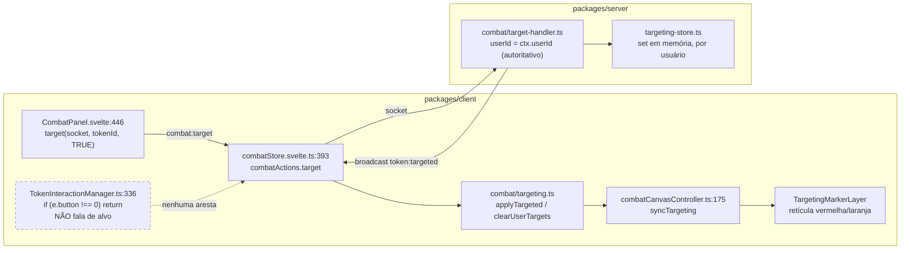
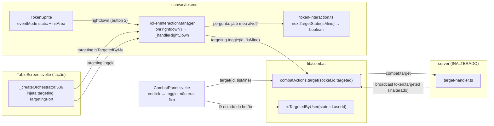

# wi-mapa-alvo-01 — Diagrama de arquitetura: gesto de alvo no mapa

Fase Design (item `wi-mapa-alvo-01`, marco M2 do plano `pln-mapa-alvo`).
Base: `origin/build/app` (`ab4966f`). **Ver antes de codar.**

> **Fora do controle de versão de propósito** — mesma instrução do `mockup.md`: levar
> `docs/design/wi-mapa-alvo-01/` para a branch do item.

## 1. O que o item muda

A cadeia de alvo existe inteira e **não é reescrita**. O item acrescenta um gesto
(`rightdown` sobre o token) e corrige um `true` fixo no painel. Servidor, protocolo,
store e camada de retícula: **zero alteração**.

## 2. Antes (as-is) — a cadeia completa com um só gatilho



Dois defeitos, não um: **(D-a)** o mapa não tem gesto; **(D-b)** o único gatilho manda
`targeted: true` sempre, então marcar errado não tem desfazer — só a limpeza de fim de
turno (REQ-CBT-055) apaga.

## 3. Depois (to-be)



Fluxo do dado: `rightdown` no sprite → tokenId pelo label `token:<id>` (helper
`_getTokenIdFromTarget`, já existe) → estado atual do alvo **do usuário local** →
`combat:target { tokenId, targeted: !atual }` → servidor resolve o userId pelo socket →
broadcast → reducer → retícula. Nada novo no caminho de volta.

## 4. Decisões de desenho

**D1 — a porta de alvo é injetada, não importada.** `TokenInteractionManager` é uma
classe PIXI sem dependência de Svelte; importar `combatStore.svelte.ts` (runes) lá
dentro quebraria isso e contaminaria os testes de canvas. Entra uma opção nova:

```ts
export interface TargetingPort {
  isTargetedByMe(tokenId: string): boolean;
  toggle(tokenId: string, targeted: boolean): Promise<void>;
}
// TokenInteractionOptions: targeting?: TargetingPort
```

`TableScreen` (`:506`) fecha sobre `getTargetingState()`, `userId` e `socket` para
montá-la. Opcional: sem a porta, o botão direito é no-op — o manager continua
construível nos testes existentes sem mudar as chamadas.

**D2 — o toggle é decidido no cliente, com a verdade do servidor.** O protocolo
`combat:target` carrega um booleano absoluto, não um "alterne" — e mudar isso seria
mexer no servidor, fora do escopo. O cliente lê o próprio estado
(`isTargetedByUser`, já exportado) e manda o inverso. Corrida de dois cliques rápidos
converge: o servidor é idempotente por `Set` e só transmite quando muda.

**D3 — `rightdown`, não `pointerdown` com `if (button === 2)`.** PIXI v8 emite
`rightdown` como evento próprio; usá-lo mantém o handler esquerdo intocado (a linha
`if (e.button !== 0) return` continua exatamente como está) e evita reabrir a máquina
de arrasto. `stopPropagation()` no handler; o `preventDefault` do menu do browser já
está no container (`FusionCanvas:133`).

**D4 — nenhuma checagem de permissão no cliente.** Qualquer usuário autenticado pode
mirar: o servidor não exige papel nem posse (`target-handler.ts:92`), e o alvo é
escopado por usuário. Diferente de mover, que tem `canMoveToken` dos dois lados. Não
inventar um gate que o servidor não tem.

**D5 — sem estado otimista.** A retícula aparece com o broadcast. Movimento precisa de
otimismo (arrastar tem que acompanhar o dedo); marcar alvo, não. Menos um caminho de
rollback.

**D6 — o conserto do painel é o mesmo predicado.** `CombatPanel.svelte:446` passa a ler
`isTargetedByUser(...)` e mandar o inverso, com `targetingStore.version` lido para a
reatividade (padrão de `AntagonistaSheet.svelte:66`) e `action-btn--active` no estado
aceso. Mapa e painel compartilham a regra — não duas noções de "alternar".

## 5. Fronteiras que este item NÃO cruza

- **Servidor**: nenhuma. `target-handler.ts`, `targeting-store.ts` e o schema
  `CombatTargetPayloadSchema` ficam como estão.
- **Protocolo**: nenhum evento novo. `combat:target` / `token:targeted` inalterados.
- **Retícula**: `TargetingMarker.ts` e `combatCanvasController.ts` não são tocados.
- **Persistência**: alvo é efêmero em memória, e continua.

## 6. Dívida e limitações que o item nomeia e não paga

- **Cor quando dois usuários miram o mesmo token**: `byLocalUser` é um `OR`, então
  "meu + de outro" desenha só vermelho. Com o gesto no mapa isso vai acontecer muito
  mais do que acontecia com o botão do painel. Não é regressão; é uma limitação que
  fica mais visível.
- **Botão direito consumido**: qualquer menu de contexto de token no futuro terá que
  disputar esse botão (ou virar clique longo / modificador).
- **NPC no fim do turno**: `registerTargetingCleanup` não limpa alvo de combatente sem
  dono jogador (comentário em `target-handler.ts:160-168`). Com o GM marcando pelo
  mapa, alvo de GM só sai clicando de novo. Comportamento atual, registrado.

## 7. Dependência entre marcos que o Plano não previu — LER ANTES DE IMPLEMENTAR

O plano registra M1/M2/M3 como independentes. **M2 não é jogável sozinho em cima de
`origin/build/app`**: lá o `TokenSprite` define `eventMode = "static"` mas **não** define
`hitArea`, e PIXI não faz hit-test de um `Container` puro sem `hitArea`/`containsPoint`.
Nenhum clique — esquerdo ou direito — resolve para um token: ele bate no
catch-all da camada, o `_getTokenIdFromTarget` não acha o label `token:` e devolve
`null`. O conserto existe, mas na branch do M1 (`111eaf5 fix(tokens): TokenSprite
precisa de hitArea para poder ser clicado`).

Consequência prática: implementar M2 em cima de `build/app` é possível, mas a **prova de
duas telas só passa** depois do M1 mergeado ou com `111eaf5` cherry-picked na branch do
item. Escolher e registrar na fase Implementar; não descobrir isso na hora da prova.

É a mesma lição já enfileirada no discovery, agora batendo de novo: peça implementada
não significa peça alcançável — procurar o gesto do usuário, não a cadeia de código que
responde a ele.

## 8. Divergência com a nota do Plano

O plano cita "o gesto de clique direito no TokenInteractionManager e o toggle no
CombatPanel" — confere. O que o plano não diz, e a leitura do código mostrou: o toque
não é só no manager, tem uma linha de fiação em `TableScreen.svelte:506` (a porta do D1)
e a dependência do §7. Se a realidade do código divergir de novo na hora de implementar,
a divergência vira nota, não silêncio.
