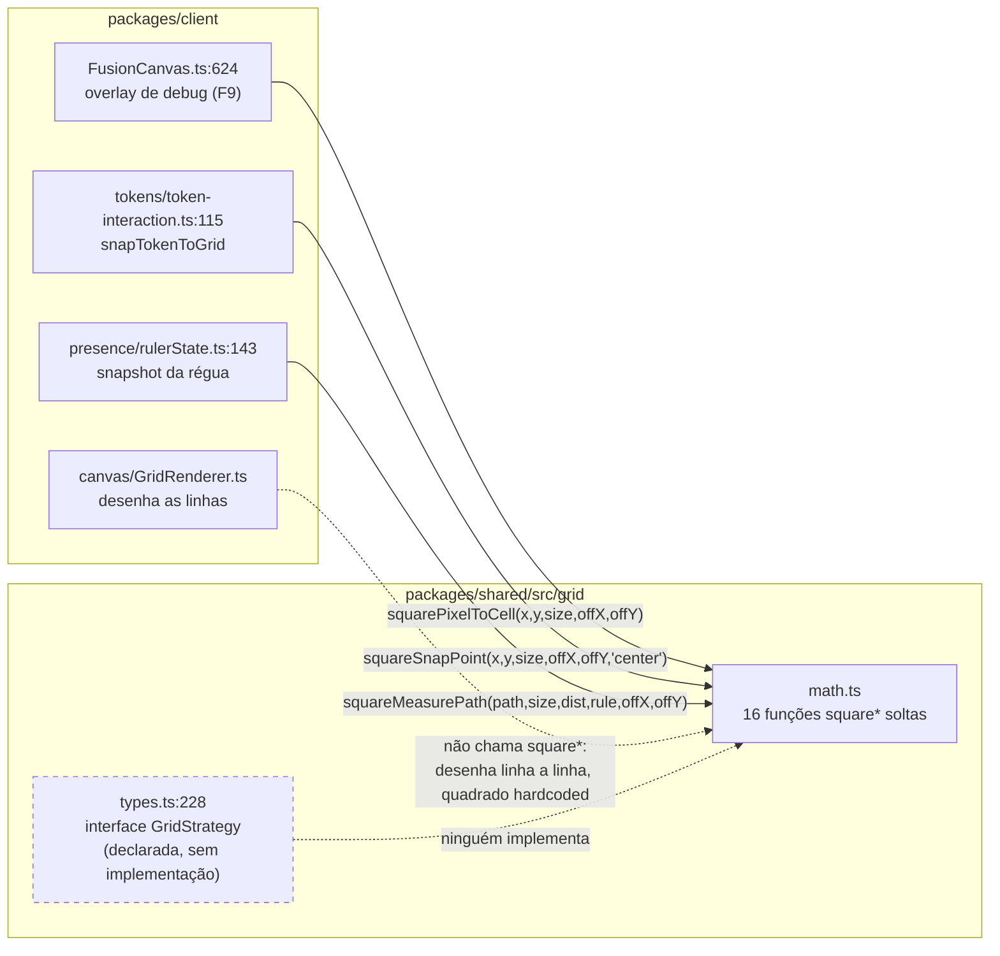
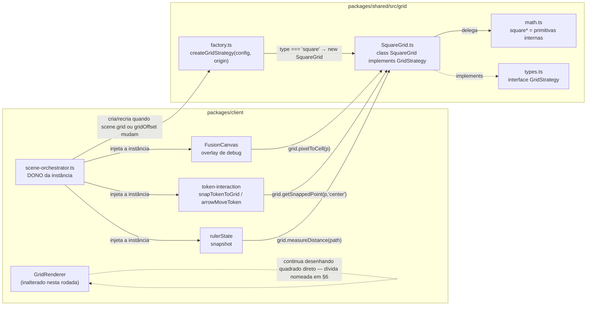

# wi-mapa-grid-01 — SquareGrid implementa GridStrategy

Diagrama de arquitetura da fase Design (item `wi-mapa-grid-01`, marco M1 do plano
`pln-mapa-grid`). Base: `origin/build/app`. Ver antes de codar.

> **Este arquivo está fora do controle de versão de propósito.** A fase Design não
> cria branch, e o checkout está em `fix/b3-i18n`. Quem pegar `wi-mapa-grid-01` deve
> levar `docs/design/wi-mapa-grid-01/` **junto com `docs/lessons.md`** para a branch do
> item (mesma instrução que a fase Plano já deixou para o `lessons.md`).

## 1. O que o item muda

`GridStrategy` está **declarada** em `packages/shared/src/grid/types.ts:228` e não tem
nenhuma implementação. Os consumidores chamam as funções `square*` de
`packages/shared/src/grid/math.ts` diretamente, cada um remontando à mão o mesmo
conjunto de parâmetros soltos (`size`, `offsetX`, `offsetY`, `distance`,
`diagonalRule`). O item fecha essa lacuna: nasce `SquareGrid`, os call-sites passam a
falar com a interface, e o tipo de grade vira um dado da cena em vez de uma suposição
espalhada pelo cliente.

**Sem mudança observável para quem joga.** É pré-requisito do item de UI de cena, que
entra no mesmo PR do marco.

## 2. Antes (as-is)

Os três call-sites reais em `origin/build/app` — verificados por `git grep`, não pela
memória do plano:

Cada seta carrega de 5 a 6 escalares. Trocar o tipo de grade hoje significa achar e
reescrever cada uma dessas listas de parâmetros.

## 3. Depois (to-be)

Fluxo do dado: `SceneDocument.grid` (+ `gridOffsetX/Y` do `SceneConfig`) →
`scene-orchestrator` → `createGridStrategy` → uma instância por cena ativa → todos os
consumidores. Nenhum call-site volta a montar parâmetro de grade à mão.

## 4. Decisões de desenho

**D1 — `SquareGrid` é um adaptador, não uma reescrita.** As funções `square*` de
`math.ts` continuam sendo a matemática; a classe só as embrulha atrás da interface.
Elas permanecem exportadas nesta rodada (os testes de `grid-integration.test.ts` e de
`shared/src/grid/__tests__` batem nelas direto), mas passam a ser tratadas como
primitivas internas: código novo fala com a interface.

**D2 — o offset não cabe em `GridConfig`.** `GridConfig` não tem `offsetX/offsetY`;
eles vivem em `SceneConfig.gridOffsetX/Y`. A interface expõe só
`readonly config: GridConfig`, então o offset entra pelo construtor
(`new SquareGrid(config, { x, y })`) e fica como estado interno da implementação. Não
mexer na interface por isso — ela já está declarada e é o contrato que hex vai honrar.

**D3 — factory com fallback, não com explosão.** `createGridStrategy(config, origin)`
devolve `SquareGrid` para `type === "square"`; para `"hex"`/`"gridless"` (e para cena
legada sem bloco `grid`) devolve `SquareGrid` e emite um `console.warn`. A UI mantém
hex desabilitado, então o caminho é inalcançável pela interface — mas uma cena salva com
`type: "hex"` por qualquer via não pode derrubar a mesa no meio da sessão. É a mesma
defense-in-depth que `GridRenderer.fromGridConfig` já pratica ao aceitar `grid` nulo.

**D4 — o dono da instância é o `scene-orchestrator`.** Ele já guarda `_scene` e já lê
`scene.grid?.size ?? 100` em dois pontos. Uma instância por cena ativa, recriada quando
`scene.grid` ou o offset mudam. Consequência nos consumidores: `rulerState.updateConfig`
passa a receber a strategy no lugar do `RulerConfig` de 6 campos, e as funções puras de
`token-interaction` trocam o parâmetro `grid: GridSnapConfig` por `grid: GridStrategy` —
continuam puras, só mudam de contrato.

**D5 — `getHighlightCells` só cobre `FootprintShape`.** `TemplateShape` é escopo de
templates, fora do M1: lança erro explícito em vez de devolver resultado errado em
silêncio. `squareFootprintCells` e `squareSnapFootprint` já existem para o caso coberto.

**D6 — `measureDistance` absorve as regras.** `distance`, `units` e `diagonalRule` vêm
do `config` da instância; o call-site da régua passa a entregar só o caminho. Isso é o
que apaga as cinco leituras de `scene.grid?.size ?? 100` espalhadas pelo cliente.

## 5. Fronteiras que este item NÃO cruza

- **Servidor**: nenhuma. Não há mudança de schema (a cena já persiste `grid.type` e
  `grid.size`) nem de contrato de rede. A validação de movimento em `doc-handlers`
  continua como está.
- **PIXI**: `shared` não importa PIXI e continua não importando — `SquareGrid` é
  matemática pura, testável sem canvas.
- **UI**: o seletor de tipo/tamanho de grade é o outro item do M1. Este entrega só o
  núcleo; os dois entram juntos no PR do marco.

## 6. Dívida que este item nomeia e não paga

`GridRenderer` **não** é um call-site de `square*`: ele desenha as linhas ele mesmo,
com quadrado embutido no `_draw`. Hoje isso não incomoda; no dia do hex, desenhar a
grade terá que sair da strategy (ou de um renderer por tipo), e esse é o pedaço do
refactor que o adaptador **não** cobre. Registrar agora vale mais do que descobrir
depois que "já estava atrás da interface".

## 7. Divergência com a nota do Plano

A fase Plano listou como call-sites `GridRenderer.ts`, `TokenInteractionManager.ts` e
`TableScreen.svelte`. Os call-sites reais de `square*` em `origin/build/app` são
`FusionCanvas.ts:624`, `tokens/token-interaction.ts:115` e
`presence/rulerState.ts:143`. `TableScreen.svelte` de fato lê `scene.grid?.size ?? 100`
(linhas 258, 287, 392), mas para dimensionar sprite, não para chamar `square*` —
`scene-orchestrator.ts` (280, 333) e `SceneCreateDialog.svelte` (64) fazem a mesma
leitura. Implementar deve seguir a lista deste documento; se a realidade do código
divergir de novo, a divergência vira nota, não silêncio.
