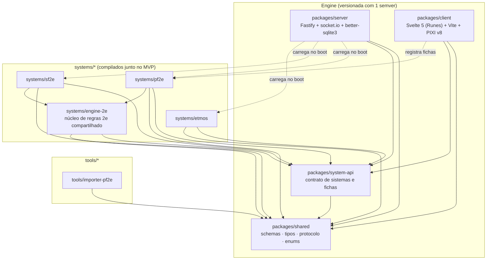
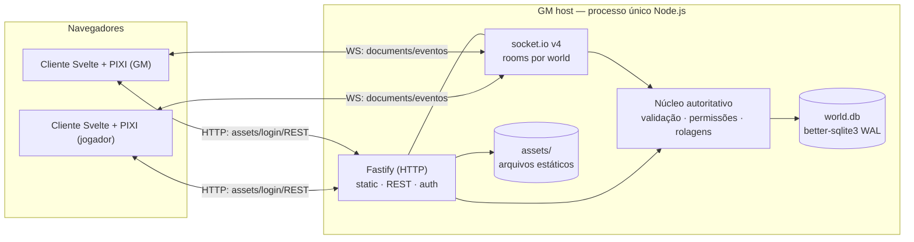

# 01 — Arquitetura Geral

- **Título:** Arquitetura Geral do Fusion VTT
- **Status:** draft v0.1
- **Data:** 2026-06-11
- **Baseada em:**
  - `docs/research/01-foundry-arquitetura-stack.md`
  - `docs/research/15-vtt-opensource-e-bibliotecas.md`
  - `docs/research/06-foundry-rede-multiplayer.md`
  - `docs/research/92-install-distribution-autoupdate.md`

> **Aviso clean-room.** Esta spec descreve uma arquitetura própria do Fusion. Onde menciona o Foundry VTT, refere-se apenas a comportamento e conceitos observáveis publicamente, usados como referência de design. Nenhum código proprietário do Foundry é reproduzido. Os dados abertos importados (compendiums `foundryvtt/pf2e` sob OGL/ORC/Apache-2.0) são tratados na spec `16-compendiums-e-importacao.md`.

---

## Objetivo

Definir a arquitetura de alto nível do Fusion: os componentes do sistema e suas fronteiras, o modelo de processo (processo único Node.js servindo HTTP + WebSocket), o boot sequence do servidor e do cliente, o lifecycle de um mundo (world), a configuração e CLI, a separação entre os fluxos de request HTTP e WebSocket, a estratégia de versionamento (engine, sistemas e mundos) e os riscos arquiteturais com suas mitigações.

Esta spec é o mapa que conecta todas as demais specs. Ela NÃO detalha o conteúdo de cada subsistema — apenas estabelece como eles se encaixam, quem fala com quem e em que ordem as coisas acontecem. Os detalhes ficam nas specs irmãs referenciadas ao longo do texto.

---

## Escopo

### O que esta spec inclui

- Diagrama de componentes do monorepo (server, client, shared, system-api, systems, tools) e suas dependências.
- Modelo de processo: processo único Node.js, autoritativo, servindo HTTP estático/REST + WebSocket no mesmo `http.Server`.
- Boot sequence do servidor (de `fusion serve` até "pronto para conexões") e do cliente (de carregar a página até `game.ready`).
- Lifecycle de um world: criar, abrir, fechar, migrar.
- Configuração: arquivo `fusion.json`, precedência de camadas, porta default própria (**33000**), flags da CLI.
- Distinção de responsabilidades entre o canal HTTP e o canal WebSocket.
- Estratégia de versionamento semver para a engine, e ranges de compatibilidade para sistemas e mundos.
- Riscos arquiteturais transversais e mitigações.

### O que esta spec NÃO inclui

- Schema dos Documents e regras de embedding → `02-modelo-de-dados.md`.
- Estrutura do banco, tabelas e migrations de mundo → `03-persistencia-e-mundos.md`.
- Protocolo de mensagens WebSocket, envelopes, ack/broadcast e reconexão → `04-rede-e-sincronizacao.md`.
- Roles, permissões e ownership → `05-usuarios-e-permissoes.md`.
- Renderização do canvas e camadas PIXI → `06-canvas-e-renderizacao.md`.
- Motor de rolagens autoritativo → `08-motor-de-rolagens.md`.
- Contrato da API de sistemas → `15-api-de-sistemas.md`.
- Empacotamento desktop (Tauri), instaladores e auto-update → `22-instalacao-e-distribuicao.md`.
- Segurança em profundidade (authn/authz, hardening, upload) → `21-seguranca.md`.

---

## Conceitos e terminologia

| Termo | Definição no Fusion |
|---|---|
| **Engine** | O conjunto de pacotes que compõem o app Fusion em si (server + client + shared + system-api), versionado com um único semver. NÃO inclui os sistemas de jogo nem os mundos. |
| **System (sistema de jogo)** | Pacote TypeScript/Svelte que define schemas de dados, fórmulas, automações e componentes de ficha para um RPG (PF2e, SF2e, Etmos). No MVP, sistemas são **compilados junto** com o app (sem carregamento dinâmico de terceiros). |
| **World (mundo)** | Uma campanha: um arquivo `world.db` (SQLite) + uma pasta `assets/`, vinculado a exatamente um system e a uma versão de engine. É a unidade de dados do usuário. |
| **Document** | Entidade persistida com schema tipado (Actor, Item, Scene, JournalEntry, ChatMessage, etc.). Definido em `02-modelo-de-dados.md`. |
| **Servidor autoritativo** | O processo Node.js é o árbitro final: valida, persiste e só então faz broadcast. Não há autoridade no cliente; rolagens e mutações de Document passam pelo servidor. |
| **GM host** | A máquina onde o servidor roda (geralmente a do GM). Os jogadores conectam pelo navegador via LAN/internet. |
| **Boot sequence** | Sequência ordenada de fases de inicialização (do servidor ou do cliente) com pontos de extensão bem definidos. |
| **`fusion.json`** | Arquivo de configuração do servidor, no diretório de dados do usuário (não dentro do world). |
| **Diretório de dados (data dir)** | Raiz que contém config, worlds e assets globais. Separado do diretório de instalação do app. |

---

## Decisões

Cada decisão lista alternativas rejeitadas e o racional.

### D1 — Processo único Node.js servindo HTTP + WebSocket no mesmo servidor

O servidor Fusion é um **único processo Node.js** que instancia um `http.Server`, monta o Fastify para HTTP (estático, REST, auth) e anexa o `socket.io` ao mesmo servidor para tempo real.

- **Alternativas rejeitadas:**
  - *Dois processos separados (HTTP e WS)*: complica deploy local, exige IPC e duplica estado em memória. O caso de uso é single-GM local — não há ganho de escala que justifique.
  - *Worker threads para o servidor de jogo*: adia o problema de event loop blocking sem resolver a fonte (ver D9 e Riscos). Mantém-se single-thread no MVP, com offload pontual para workers só onde medido como necessário (ex.: visibility polygon pesado — ver `07-visao-iluminacao-fog.md`).
- **Racional:** A pesquisa confirma que o Foundry roda como processo único Node.js servindo HTTP + WS simultaneamente (research 01 §2.1, research 06 §1). Um processo único compartilha o estado do world em memória sem serialização entre componentes, simplifica o boot e o lifecycle, e é suficiente para o público-alvo. Montar `socket.io` no mesmo `http.Server` do Fastify é o padrão suportado pela lib (research 15 §13.1: "socket.io é montado no mesmo server instance").

### D2 — Fastify para HTTP, socket.io v4 para tempo real

HTTP (assets estáticos, REST, auth) usa **Fastify**; o tempo real (sync de Documents, eventos de canvas, chat) usa **socket.io v4**.

- **Alternativas rejeitadas:**
  - *Express 5* (escolha do Foundry v14, research 01 §3.1): Fastify entrega ~2x throughput e validação de schema/serialização pré-compilada built-in (research 15 §13.1), útil para validar payloads de Document e REST.
  - *WebSocket nativo do browser* (caminho do Foundry v12+, research 06 §2): o Foundry migrou para reduzir overhead, mas o ganho é irrelevante em LAN (research 15 §4.1). socket.io entrega rooms/namespaces, reconexão e fallback "de graça", o que reduz código de protocolo no MVP. A stack está fixada em socket.io v4.
  - *Colyseus*: orientado a jogos de estado altamente dinâmico; o VTT é document-oriented com updates esparsos e semânticos (research 15 §4.2). Over-engineering para o caso.
- **Racional:** Decisão de stack já fixada pelo projeto; a pesquisa a valida. As **rooms** do socket.io isolam um world por room e permitem broadcast seletivo (por cena, por GM, por usuário). O protocolo concreto vive em `04-rede-e-sincronizacao.md`.

### D3 — Persistência: um `world.db` (better-sqlite3, WAL) por mundo + `assets/` estático

Cada world é um arquivo SQLite autocontido (`world.db`) acessado via **better-sqlite3** em **WAL mode**, mais uma pasta `assets/` servida estaticamente.

- **Alternativas rejeitadas:**
  - *LevelDB/ClassicLevel* (escolha do Foundry v11+, research 01 §3.1, research 06 §10): key-value binário não-queryable, exige índices manuais, arquivos não diff-áveis e impõe locks exclusivos que complicam multi-mundo (research 06 §10). SQLite é relacional, queryable e um único arquivo portátil.
  - *node:sqlite nativo (Node 22+)*: viável e sem dependência (research 15 §11.1), mas better-sqlite3 é mais maduro e ergonômico hoje; ver risco de empacotamento de addon nativo em `22-instalacao-e-distribuicao.md`.
- **Racional:** better-sqlite3 tem API síncrona (sem overhead de event loop para queries locais), ACID e WAL para leitura concorrente durante escrita (research 15 §11.1). Um arquivo por world = backup e portabilidade triviais. Detalhes de schema e migrations em `03-persistencia-e-mundos.md`.

### D4 — Cliente: Svelte 5 (Runes) + Vite para UI; PIXI.js v8 para o canvas

Toda a UI (HUD, sidebar, fichas, diálogos) é **Svelte 5 (Runes)** buildado por **Vite**; o canvas do mapa é **PIXI.js v8** (WebGPU com fallback WebGL).

- **Alternativas rejeitadas:**
  - *React*: bundle maior e Contexts ruins para estado de canvas — o Owlbear Rodeo 1.x relatou exatamente isso como erro (research 15 §1.2, §12.2). Svelte tem reatividade fine-grained e bundle menor (research 15 §12.1).
  - *PIXI v7 / WebGL-only* (alvo atual do Foundry, research 01 §6.4): PIXI v8 já é WebGPU-ready com fallback WebGL automático e Render Groups para câmera 2D hardware-accelerated (research 15 §3.1), essenciais para pan/zoom em mapas grandes.
- **Racional:** Stack fixada e validada. PIXI ocupa um `<canvas>` dedicado e Svelte gerencia o overlay de UI — coexistem sem conflito (research 15 §12.1). Detalhes em `06-canvas-e-renderizacao.md` e `11-ui-framework-e-fichas.md`.

### D5 — Monorepo pnpm com fronteira `shared` no centro

Layout: `packages/server`, `packages/client`, `packages/shared`, `packages/system-api`, `systems/*`, `tools/*`. O pacote `shared` contém schemas, tipos e o protocolo, e é a **única** dependência comum entre server e client.

- **Alternativas rejeitadas:**
  - *Repos separados*: dificulta manter tipos do protocolo e dos Documents em sincronia entre server e client; cria drift de versão.
  - *Tudo em um pacote*: impede impor fronteiras de dependência (ex.: impedir o client de importar código de servidor).
- **Racional:** O contrato (schemas Zod/TypeScript dos Documents, envelopes de socket, enums de role) precisa ser idêntico nos dois lados. Centralizá-lo em `shared` garante uma única fonte de verdade e habilita validação isomórfica (mesmo schema valida no client antes de enviar e no server ao receber). A direção de dependências é estrita (ver Requisitos).

### D6 — Sistemas compilados junto no MVP (sem plugins dinâmicos de terceiros)

Os sistemas (`systems/pf2e`, `systems/sf2e`, `systems/etmos`) são pacotes do monorepo **compilados junto** com o app. O núcleo de regras 2e compartilhado entre PF2e e SF2e vive no pacote `systems/engine-2e`, do qual `systems/pf2e` e `systems/sf2e` dependem. Não há carregamento dinâmico de plugins de terceiros no MVP.

- **Alternativas rejeitadas:**
  - *Carregamento dinâmico de plugins arbitrários no MVP* (modelo de packages do Foundry, research 01 §5.1, research 15 §2.4): superfície de segurança grande (execução de código de terceiros), complexidade de sandbox e de versionamento. Marcado como **[V2]**.
- **Racional:** Reduz risco e escopo do MVP. Os sistemas registram suas fichas e schemas pela system API (`15-api-de-sistemas.md`) durante o boot. O carregamento dinâmico fica como evolução [V2].

### D7 — Porta default própria 33000 (não 30000)

A porta TCP default do servidor Fusion é **33000**.

- **Alternativas rejeitadas:**
  - *30000*: é a porta default do Foundry VTT (research 01 §2.2, research 06 §1). Reusá-la causaria conflito de porta para quem roda os dois apps na mesma máquina e confundiria diagnósticos de rede.
  - *Portas "bonitas" comuns (8080, 3000)*: alta chance de colisão com outros serviços de dev.
- **Racional:** 33000 é alto o bastante para não exigir privilégio, distinto do Foundry e mnemônico ("33" ≈ Fusion). Configurável via `fusion.json` → `port` ou flag `--port` (ver Configuração).

### D8 — Validação isomórfica com fonte de verdade no servidor

Os mesmos schemas (em `shared`) validam no cliente (UX rápida, feedback imediato) e no servidor (autoridade). A validação do cliente é conveniência; a do servidor é lei.

- **Alternativas rejeitadas:**
  - *Validar só no servidor*: round-trip para todo erro trivial de formulário, UX pior.
  - *Validar só no cliente*: inseguro — cliente é não-confiável (anti-cheat, ver `08-motor-de-rolagens.md` e `21-seguranca.md`).
- **Racional:** O servidor é autoritativo (research 06 §3). Reusar o schema dos dois lados elimina divergência sem abrir mão da autoridade. As rolagens em particular executam **no servidor** (RNG autoritativo) por anti-cheat — decisão da stack, detalhada em `08-motor-de-rolagens.md`.

### D9 — Operações pesadas fora do caminho síncrono do socket

Operações potencialmente longas (visibility polygon, importação de compendium, migração de world) NÃO bloqueiam o handler de socket: são feitas de forma assíncrona, em chunks, ou (quando medido necessário) em worker threads.

- **Alternativas rejeitadas:**
  - *Executar tudo no event loop principal de forma síncrona*: trava a sincronização de todos os jogadores durante a operação (risco de event loop blocking — ver Riscos).
- **Racional:** O servidor é single-thread; uma operação O(n) longa congela o broadcast para todos. Estratégia detalhada por subsistema (`07`, `16`, `03`). Esta spec apenas estabelece o princípio.

---

## Requisitos funcionais

> Tags: **[MVP]** = necessário para a definição de MVP global (jogar uma sessão de PF2e com mapa+grid, tokens, visão/fog básicos, fichas, rolagens básicas, chat, combat tracker). **[V2]** = pós-MVP.

### Componentes e monorepo

- **REQ-ARQ-001** [MVP] O repositório DEVE ser um monorepo pnpm workspaces com os pacotes: `packages/server`, `packages/client`, `packages/shared`, `packages/system-api`, `systems/engine-2e`, `systems/pf2e`, `systems/sf2e`, `systems/etmos`, `tools/importer-pf2e`. O pacote `systems/engine-2e` contém as mecânicas comuns ao PF2e e ao SF2e (degrees of success, modifier stacking, TEML, condições base, dying/wounded, apply damage/IWR, MAP) e é TypeScript puro, sem dependência de Svelte nem de sistema de jogo específico (`ver 17-sistema-pf2e.md` DEC-PF2-01).
- **REQ-ARQ-002** [MVP] O pacote `packages/shared` DEVE conter os schemas de Document, os tipos do protocolo de socket e os enums compartilhados (roles, ownership levels, tipos de evento), e NÃO DEVE importar de `server`, `client`, `system-api` nem de `systems/*`.
- **REQ-ARQ-003** [MVP] `packages/client` NÃO DEVE importar de `packages/server` (nenhum código de servidor pode acabar no bundle do navegador). A verificação DEVE ser imposta por lint de dependências no CI.
- **REQ-ARQ-004** [MVP] `packages/server` NÃO DEVE importar de `packages/client`.
- **REQ-ARQ-005** [MVP] Tanto `server` quanto `client` PODEM importar de `shared`; ambos PODEM importar de `system-api`; os `systems/*` PODEM importar de `shared`, `system-api` e `systems/engine-2e`, e NÃO DEVEM importar de `server` nem de `client` diretamente (interagem via a system API). O pacote `systems/engine-2e` NÃO DEVE importar de `server`, `client`, `system-api` nem dos demais `systems/*`.
- **REQ-ARQ-006** [MVP] Todo o código DEVE compilar sob TypeScript estrito (`strict: true`) e Node.js 22+.

### Modelo de processo e boot do servidor

- **REQ-ARQ-007** [MVP] O servidor DEVE rodar como um único processo Node.js que cria um `http.Server`, monta o Fastify para HTTP e anexa `socket.io` ao mesmo `http.Server`.
- **REQ-ARQ-008** [MVP] O boot do servidor DEVE seguir fases ordenadas: (1) carregar config; (2) resolver/validar o data dir; (3) registrar plugins HTTP (static, REST, auth); (4) registrar sistemas compilados na system API; (5) anexar e configurar o socket.io; (6) começar a escutar na porta. O servidor SÓ DEVE aceitar conexões WebSocket após a fase (6).
- **REQ-ARQ-009** [MVP] Em modo "sem world aberto" (setup), o servidor DEVE servir a UI de gerenciamento (listar/criar/abrir worlds) e NÃO DEVE expor dados de jogo.
- **REQ-ARQ-010** [MVP] Ao abrir um world, o servidor DEVE: abrir o `world.db`, verificar compatibilidade de versão (engine, sistema, schema do world — ver Versionamento), executar migrations pendentes se necessário, carregar o sistema vinculado e disponibilizar a room do socket.io correspondente.
- **REQ-ARQ-011** [MVP] O servidor DEVE emitir um evento de log claro de "pronto para conexões" contendo a porta, a URL LAN detectada e o world ativo (se houver).
- **REQ-ARQ-012** [MVP] O servidor DEVE tratar `SIGINT`/`SIGTERM` com shutdown gracioso: parar de aceitar novas conexões, finalizar o checkpoint do WAL do `world.db` aberto, fechar conexões de socket e encerrar.

### Boot do cliente

- **REQ-ARQ-013** [MVP] O cliente DEVE seguir fases ordenadas: (1) carregar o bundle e autenticar; (2) abrir a conexão WebSocket e fazer handshake de versão de protocolo; (3) receber o snapshot inicial do estado do world (Documents que o usuário pode ver); (4) inicializar o canvas PIXI e a UI Svelte; (5) sinalizar `game.ready`.
- **REQ-ARQ-014** [MVP] Atualizações de Document recebidas via socket entre o handshake e `game.ready` DEVEM ser bufferizadas e aplicadas em ordem após `game.ready`, sem perda (mitiga a janela de perda de updates observada como bug no Foundry — research 06 §8).
- **REQ-ARQ-015** [MVP] Se o handshake de versão de protocolo indicar incompatibilidade, o cliente DEVE exibir uma mensagem clara de "versão incompatível" com instrução de update, em vez de prosseguir com estado corrompido (research 92 §6).

### Lifecycle de world

- **REQ-ARQ-016** [MVP] O servidor DEVE permitir **criar** um world: nome/slug, sistema-alvo, versão de engine; isso cria `world.db` (com schema na versão corrente) e a pasta `assets/`.
- **REQ-ARQ-017** [MVP] O servidor DEVE permitir **abrir** exatamente um world por vez no MVP; abrir um segundo world DEVE exigir fechar o atual.
- **REQ-ARQ-018** [MVP] O servidor DEVE permitir **fechar** o world ativo: desconectar jogadores com mensagem, fazer flush/checkpoint do banco e voltar ao modo setup.
- **REQ-ARQ-019** [MVP] Ao abrir um world cujo schema é mais antigo que o suportado pela engine corrente, o servidor DEVE executar **migrations** versionadas e idempotentes antes de aceitar conexões; uma migration que falhe DEVE abortar a abertura sem corromper o `world.db` (ver `03-persistencia-e-mundos.md`).
- **REQ-ARQ-020** [MVP] Antes de qualquer migration destrutiva, o servidor DEVE criar um backup automático do `world.db` (ver `24-operacao-backups-telemetria.md`).
- **REQ-ARQ-021** [V2] O servidor DEVE suportar **múltiplos worlds abertos simultaneamente**, cada um em sua room de socket isolada.

### Configuração e CLI

- **REQ-ARQ-022** [MVP] O servidor DEVE ler a configuração de `fusion.json` no data dir, com a porta default **33000** quando não especificada.
- **REQ-ARQ-023** [MVP] A precedência de configuração DEVE ser, do maior para o menor: (1) flags da CLI; (2) variáveis de ambiente `FUSION_*`; (3) `fusion.json`; (4) defaults embutidos.
- **REQ-ARQ-024** [MVP] A CLI DEVE expor o subcomando `fusion serve` com, no mínimo, as flags: `--port`, `--data-dir`, `--host`, `--world <slug>` (abrir um world direto no boot), `--no-upnp`, `--config <path>`.
- **REQ-ARQ-025** [MVP] A CLI DEVE expor subcomandos utilitários mínimos: `fusion world list`, `fusion world create`, `fusion world backup <slug>` (ver specs `03` e `24`).
- **REQ-ARQ-026** [MVP] Se a porta configurada estiver ocupada, o servidor DEVE falhar com mensagem clara indicando a porta e como alterá-la, em vez de erro cru de `EADDRINUSE`.
- **REQ-ARQ-027** [MVP] O data dir default e o layout exato de subpastas são definidos em `22-instalacao-e-distribuicao.md` REQ-DST-007/REQ-DST-008 (fonte única de verdade). O data dir DEVE ser separado do diretório de instalação do app (research 01 §11.2, research 92 §8).

### Fluxo de request: HTTP vs WebSocket

- **REQ-ARQ-028** [MVP] O canal **HTTP** DEVE atender: assets estáticos (imagens, áudio, build do client), autenticação/login, e endpoints REST de baixa frequência (ex.: listar worlds, healthcheck, upload de asset).
- **REQ-ARQ-029** [MVP] O canal **WebSocket** DEVE atender: todas as operações de Document (create/update/delete), eventos de canvas (movimento de token, ping, ruler), chat, rolagens e eventos de presença.
- **REQ-ARQ-030** [MVP] Dados grandes (imagens, áudio) NÃO DEVEM trafegar pelo WebSocket; DEVEM ser servidos por HTTP estático e referenciados por URL nos Documents (research 15 §2.5: "dados grandes são servidos via HTTP estático, não pelo socket").
- **REQ-ARQ-031** [MVP] Toda mutação de Document via WebSocket DEVE ser validada (schema + permissão) e persistida pelo servidor **antes** do broadcast; o servidor é autoritativo e aplica o delta na ordem de chegada (last-writer-wins por campo no MVP) — detalhes em `04-rede-e-sincronizacao.md`.
- **REQ-ARQ-032** [MVP] As rolagens de dados DEVEM ser executadas no servidor (RNG autoritativo) e o resultado distribuído via WebSocket (anti-cheat) — ver `08-motor-de-rolagens.md`.

### Versionamento

- **REQ-ARQ-033** [MVP] A **engine** DEVE seguir SemVer (`MAJOR.MINOR.PATCH`). O número de versão DEVE estar acessível em runtime (cliente e servidor) e no log de boot.
- **REQ-ARQ-034** [MVP] Cada **system** DEVE declarar, no seu manifest, sua própria versão e um range de compatibilidade com a engine (ex.: `engine: ">=1.2.0 <2.0.0"`); o servidor DEVE recusar carregar um system fora do range com mensagem clara.
- **REQ-ARQ-035** [MVP] Cada **world** DEVE registrar em seu `world.db` a versão de engine, o id e a versão do system vinculado, e a versão do schema do world.
- **REQ-ARQ-036** [MVP] O servidor DEVE incluir uma **versão de protocolo** no handshake WebSocket; cliente e servidor com versões de protocolo incompatíveis DEVEM recusar a sessão (REQ-ARQ-015).
- **REQ-ARQ-037** [V2] O sistema DEVE suportar canais de release (stable/testing) para a engine, à semelhança dos canais do Foundry (research 01 §8, research 92 §1).

---

## Requisitos não-funcionais

- **REQ-ARQ-038** [MVP] **Latência LAN:** uma operação de update de Document de tamanho típico (mover token, ajustar HP) DEVE ter round-trip mediano < 100 ms em LAN com 1 GM + até 5 jogadores.
- **REQ-ARQ-039** [MVP] **Não-bloqueio do event loop:** nenhum handler de socket DEVE bloquear o event loop por > 50 ms em operações normais de jogo; operações reconhecidamente pesadas seguem D9.
- **REQ-ARQ-040** [MVP] **Footprint do servidor:** o servidor DEVE iniciar e operar uma sessão de MVP em uma máquina com 4 GB de RAM e 2 vCPUs (alinha com o baseline de hardware da pesquisa, research 01 §9.1).
- **REQ-ARQ-041** [MVP] **Boot frio:** do `fusion serve` até "pronto para conexões" com um world pequeno aberto DEVE levar < 5 s em hardware baseline.
- **REQ-ARQ-042** [MVP] **Degradação de GPU:** o cliente DEVE detectar a ausência de WebGPU e cair para WebGL automaticamente (capacidade nativa do PIXI v8, research 15 §3.1), sem intervenção do usuário.
- **REQ-ARQ-043** [MVP] **Portabilidade de world:** um world DEVE ser portável copiando `world.db` + `assets/`; nenhum estado essencial do world pode viver fora desses dois artefatos.
- **REQ-ARQ-044** [MVP] **i18n:** todas as strings de UI do app DEVEM ser externalizáveis; pt-BR é o idioma primário e en o secundário.
- **REQ-ARQ-045** [V2] **Escala:** a arquitetura NÃO precisa suportar múltiplos worlds concorrentes nem múltiplas instâncias compartilhando dados no MVP, mas o design NÃO DEVE impedir a evolução para múltiplos worlds (REQ-ARQ-021).

---

## Modelo de dados

Esta spec não define Documents (ver `02-modelo-de-dados.md`). Define apenas os tipos de configuração e de manifesto que pertencem à camada de arquitetura.

```typescript
// packages/shared — configuração do servidor (fusion.json)
export interface FusionServerConfig {
  /** Porta TCP de escuta. Default: 33000. */
  port: number;
  /** Host de bind. Default: "0.0.0.0" (aceita LAN). */
  host: string;
  /** Raiz dos dados do usuário (config, worlds, assets). */
  dataDir: string;
  /** Hostname customizado para montar links de convite (opcional). */
  hostname?: string;
  /** Tentar abrir portas no roteador via UPnP. Default: true. */
  upnp: boolean;
  /** Slug do world a abrir automaticamente no boot (opcional). */
  autoOpenWorld?: string;
  /** Configuração de TLS direto (opcional; ver 21-seguranca.md). */
  tls?: { keyPath: string; certPath: string };
  /** Atrás de reverse proxy com SSL terminado externamente. */
  proxySSL?: boolean;
}

// packages/shared — manifesto de um sistema de jogo
export interface SystemManifest {
  /** Identificador estável, ex.: "pf2e". */
  id: string;
  /** Nome exibido, ex.: "Pathfinder 2e (Remaster)". */
  title: string;
  /** SemVer do próprio sistema. */
  version: string;
  /** Range SemVer da engine com que é compatível, ex.: ">=1.0.0 <2.0.0". */
  engineCompat: string;
  /** Idiomas suportados pelo sistema. */
  languages: string[];
}

// packages/shared — metadados de versionamento de um world
export interface WorldVersionInfo {
  /** Versão da engine com que o world foi criado/migrado por último. */
  engineVersion: string;
  /** Sistema vinculado e sua versão no momento da última abertura. */
  systemId: string;
  systemVersion: string;
  /** Versão do schema do banco do world (inteiro monotônico). */
  worldSchemaVersion: number;
}

// packages/shared — versão de protocolo trocada no handshake WebSocket
export interface ProtocolHandshake {
  /** Versão do protocolo de socket. Incompatibilidade encerra a sessão. */
  protocolVersion: number;
  /** Versão da engine do servidor (informativo para o cliente). */
  engineVersion: string;
}
```

---

## API e eventos

Esta spec descreve apenas o **enquadramento** dos canais. O contrato detalhado de eventos de socket está em `04-rede-e-sincronizacao.md`; os endpoints REST e auth em `05-usuarios-e-permissoes.md` e `21-seguranca.md`.

### Diagrama de componentes (monorepo)



### Diagrama de processo e fluxo de request (runtime)



### Boot sequence do servidor (resumo)

```
fusion serve
  → carregar config (CLI > env > fusion.json > defaults)
  → resolver/criar data dir (ver 22-instalacao-e-distribuicao.md REQ-DST-007/008)
  → registrar plugins HTTP (static, REST, auth)
  → registrar systems compilados na system API
  → [se --world] abrir world: open world.db → checar versões → migrar se preciso → carregar system
  → anexar socket.io ao http.Server e configurar rooms
  → listen(port) → log "pronto para conexões" (porta + URL LAN + world ativo)
```

### Boot sequence do cliente (resumo)

```
carregar bundle → autenticar (HTTP)
  → abrir WebSocket → handshake de protocolo (checar versão)
  → receber snapshot inicial (Documents visíveis) [bufferizar updates concorrentes]
  → inicializar canvas PIXI (WebGPU→WebGL) + UI Svelte + registrar fichas do system
  → aplicar buffer → game.ready
```

---

## Dependências (specs irmãs)

- `02-modelo-de-dados.md` — schema dos Documents que esta arquitetura sincroniza e persiste.
- `03-persistencia-e-mundos.md` — estrutura do `world.db`, migrations e backups referenciados no lifecycle.
- `04-rede-e-sincronizacao.md` — protocolo concreto de socket, envelopes, ack/broadcast, reconexão.
- `05-usuarios-e-permissoes.md` — auth, roles e ownership que o núcleo autoritativo aplica.
- `06-canvas-e-renderizacao.md` — canvas PIXI v8 inicializado no boot do cliente.
- `08-motor-de-rolagens.md` — execução autoritativa de rolagens no servidor.
- `11-ui-framework-e-fichas.md` — framework Svelte e registro de fichas pelo system.
- `15-api-de-sistemas.md` — contrato pelo qual os systems se registram no boot.
- `16-compendiums-e-importacao.md` — importação dos dados abertos (operação pesada, D9).
- `21-seguranca.md` — hardening do servidor autoritativo, upload e TLS.
- `22-instalacao-e-distribuicao.md` — empacotamento, Tauri [fase 2], CLI distribuída e auto-update.
- `24-operacao-backups-telemetria.md` — backups automáticos antes de migrar, telemetria de operação.
- `27-roadmap-e-milestones.md` — sequência de entrega das capacidades aqui descritas.

---

## Critérios de aceitação

- **CA-1** O monorepo compila com TypeScript estrito e o lint de fronteiras de dependência (REQ-ARQ-002 a REQ-ARQ-005) falha o CI se violado.
- **CA-2** `fusion serve --port 33000` sobe o servidor, e `fusion serve` sem flag usa 33000 por default; com a porta ocupada, a mensagem de erro cita a porta e como mudá-la (REQ-ARQ-022, REQ-ARQ-026).
- **CA-3** A precedência CLI > env > arquivo > default é demonstrável: a mesma chave definida em mais de uma camada resolve pela de maior precedência (REQ-ARQ-023).
- **CA-4** Criar → abrir → fechar um world percorre o lifecycle sem deixar locks ou WAL pendentes; o world resultante é portável copiando `world.db` + `assets/` (REQ-ARQ-016 a REQ-ARQ-018, REQ-ARQ-043).
- **CA-5** Abrir um world com schema antigo dispara migration versionada com backup prévio; uma migration que falha aborta a abertura sem corromper o `world.db` (REQ-ARQ-019, REQ-ARQ-020).
- **CA-6** Carregar um system com `engineCompat` fora do range da engine é recusado com mensagem clara (REQ-ARQ-034).
- **CA-7** Um cliente com versão de protocolo incompatível recebe a tela de "versão incompatível" e não estabelece a sessão de jogo (REQ-ARQ-015, REQ-ARQ-036).
- **CA-8** Updates de Document recebidos durante o boot do cliente não são perdidos: aplicam-se em ordem após `game.ready` (REQ-ARQ-014).
- **CA-9** Uma mutação de Document trafega por WebSocket e é validada/persistida antes do broadcast; um asset (imagem) trafega por HTTP estático e nunca pelo socket (REQ-ARQ-029, REQ-ARQ-030, REQ-ARQ-031).
- **CA-10** Em uma máquina baseline (4 GB / 2 vCPU), o boot frio com world pequeno fica < 5 s e o round-trip de mover token em LAN fica < 100 ms mediano (REQ-ARQ-040, REQ-ARQ-041, REQ-ARQ-038).
- **CA-11** Num host sem WebGPU, o cliente renderiza via WebGL sem ação do usuário (REQ-ARQ-042).
- **CA-12** `SIGINT` no servidor faz shutdown gracioso com checkpoint do WAL e desconexão limpa dos sockets (REQ-ARQ-012).

---

## Questões em aberto

- **Q1 — Bind host default.** `host: "0.0.0.0"` aceita LAN por default (UX melhor para o GM), mas expõe na rede sem auth forte por padrão. Default `0.0.0.0` com auth obrigatória, ou `127.0.0.1` exigindo opt-in para LAN? Decisão final depende de `21-seguranca.md`.
- **Q2 — Túnel de internet integrado.** A pesquisa sugere integrar Cloudflare Tunnel como fallback de WAN (research 92 §7). Entra no MVP ou fica [V2]? Decidir junto com `22-instalacao-e-distribuicao.md`.
- **Q3 — UPnP no MVP.** UPnP automático (como o Foundry) é conveniente mas tem superfície de segurança e confiabilidade variável por roteador. Habilitar por default ou exigir opt-in? Cruzar com `21-seguranca.md`.
- **Q4 — Granularidade do snapshot inicial.** O snapshot inicial enviado ao cliente deve conter todos os Documents visíveis de uma vez, ou carregar cenas/compendiums sob demanda (lazy load, como o Foundry faz com packs — research 01 §5.5)? Impacta `04-rede-e-sincronizacao.md` e o tempo até `game.ready`.
- **Q5 — Worker thread para visibility polygon.** Definir o limiar (nº de paredes / tamanho de cena) a partir do qual o cálculo de visão migra para worker thread (D9). Requer medição; cruzar com `07-visao-iluminacao-fog.md`.
- **Q6 — Política de concorrência por documento.** O MVP adota last-writer-wins por campo (research 06 §8). Há Documents (ex.: combat tracker, iniciativa) que exigem locking otimista ou ordenação especial? Cruzar com `04` e `10-combate-e-iniciativa.md`.
- **Q7 — `better-sqlite3` vs `node:sqlite` no empacotamento.** O addon nativo do better-sqlite3 complica o empacotamento desktop (research 92 §9). Manter better-sqlite3 e resolver o addon, ou migrar para `node:sqlite` nativo do Node 22+? Decidir com `22-instalacao-e-distribuicao.md`.

---

## Referências

- `docs/research/01-foundry-arquitetura-stack.md` — arquitetura cliente/servidor, stack, DataModel, pacotes/lifecycle, canvas, versões, hardware, limites clean-room.
- `docs/research/15-vtt-opensource-e-bibliotecas.md` — lições de VTTs open-source, bibliotecas candidatas e tabela de decisão de stack (PIXI v8, socket.io, better-sqlite3, Svelte 5, Fastify).
- `docs/research/06-foundry-rede-multiplayer.md` — arquitetura de servidor, transporte, protocolo CRUD de Document, autoridade do servidor, concorrência/reconexão, buffering de updates, hosting/NAT.
- `docs/research/92-install-distribution-autoupdate.md` — distribuição, versionamento servidor/cliente, bootstrapping de jogadores, primeira execução, empacotamento do runtime Node.js.
