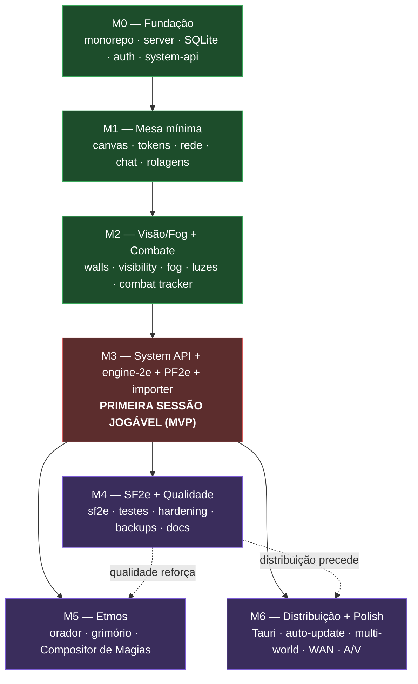

# 27 — Roadmap e Milestones

- **Título:** Roadmap e Milestones do Fusion VTT
- **Status:** draft v0.1
- **Data:** 2026-06-11
- **Baseada em:**
  - `00-visao-e-escopo.md` — definição de MVP global e tags [MVP]/[V2]
  - `01-arquitetura-geral.md` — componentes, boot sequence, dependências arquiteturais
  - `15-api-de-sistemas.md` — contrato engine ↔ sistemas (central do projeto)
  - `17-sistema-pf2e.md` — sistema de validação do MVP e núcleo `engine-2e`
  - Todas as specs irmãs (02–26) — seções Escopo/Dependências e tags [MVP]/[V2]

---

## Objetivo

Definir as **fases de entrega** (milestones M0–M6) do Fusion, o **grafo de dependências** entre elas, o **caminho crítico**, e a **Definition of Done (DoD) verificável** de cada marco. Este documento é o elo que converte as tags [MVP]/[V2] espalhadas pelas 26 specs irmãs em uma sequência de entrega coerente, sem conflitos de fase e sem dependências para frente.

As tags [MVP]/[V2] e os requisitos `REQ-*` das specs de subsistema são as **fontes de verdade** do conteúdo; esta spec apenas os **agrupa por marco**, define a **ordem de implementação**, fixa **quando cada marco está completo** e estabelece os requisitos `REQ-ROD-NNN` que governam o próprio processo de roadmap (existência de DoD, ausência de ciclos, rastreabilidade spec→marco, critério de "primeira sessão jogável").

Esta spec **não** redefine nenhum requisito de subsistema; ela os referencia por ID.

---

## Escopo

### O que esta spec inclui

- A divisão em marcos **M0–M6** (M0–M3 entregam o MVP global; M4–M6 entregam capacidades [V2]).
- Para cada marco: objetivo, entregáveis, specs/REQs cobertos (com REQ-IDs citados), DoD verificável, complexidade relativa (P/M/G/GG) e riscos.
- A **sequência sugerida** e o **grafo de dependências** entre marcos (Mermaid) com o **caminho crítico**.
- O **critério explícito de "primeira sessão jogável"** (MVP global) e em qual marco ocorre.
- A política de versionamento pré-1.0 (`engineCompat` durante 0.x).
- A **tabela de mapeamento spec → marco(s)** em que cada spec é implementada.
- Os requisitos `REQ-ROD-NNN` de governança do roadmap.

### O que esta spec NÃO inclui

- **Datas-calendário** ou estimativas de esforço em horas (projeto pessoal, ritmo variável). A complexidade é expressa só relativamente (P/M/G/GG).
- O **conteúdo detalhado** dos requisitos de subsistema (cada spec irmã é a fonte normativa).
- Dependências de **ferramentas externas** (CI provider, hospedagem, IDE).
- A reconciliação de contradições cross-spec (tratada nas próprias specs; aqui apenas registramos as que afetam fase em _Questões em aberto_).

---

## Conceitos e terminologia

| Termo                        | Definição                                                                                                                                                     |
| ---------------------------- | ------------------------------------------------------------------------------------------------------------------------------------------------------------- |
| **Marco (milestone)**        | Conjunto coeso de capacidades cuja conclusão entrega valor observável. Cada marco tem uma DoD binária: passou ou não passou.                                  |
| **Definition of Done (DoD)** | Lista de critérios **verificáveis** que determinam se um marco está concluído. Todos devem ser atendidos.                                                     |
| **Bloqueante**               | Um marco/subsistema A é bloqueante de B quando B não pode ser implementado nem testado sem A funcionando.                                                     |
| **Caminho crítico**          | A cadeia mais longa de marcos bloqueantes; atrasos nela atrasam o MVP global.                                                                                 |
| **Complexidade relativa**    | Estimativa qualitativa de esforço/risco do marco, em quatro níveis: **P** (pequeno), **M** (médio), **G** (grande), **GG** (muito grande).                    |
| **[MVP]**                    | Requisito necessário ao MVP global: o grupo joga uma sessão completa de PF2e. Coberto por M0–M3.                                                              |
| **[V2]**                     | Requisito pós-MVP. Coberto por M4–M6.                                                                                                                         |
| **Primeira sessão jogável**  | O critério de aceitação do MVP global (ver seção dedicada). Ocorre ao final de **M3**.                                                                        |
| **[SF2-CORE]/[ETM-CORE]**    | Escopo interno "jogável" dos sistemas SF2e/Etmos. As specs 18/19 marcam isso como `[MVP]` _interno_; no escopo **global** do Fusion ambos são [V2] (M4 e M5). |

---

## Sequência de marcos (visão geral)

A sequência valida-se contra as dependências reais declaradas nas seções _Dependências_ das specs irmãs. Os marcos M0–M3 são uma **cadeia linear estrita** (cada um bloqueia o seguinte) porque o MVP global exige a pilha completa de baixo para cima; M4–M6 ramificam sobre o MVP entregue.

| Marco  | Tema                                                                                | Fase | Complexidade |
| ------ | ----------------------------------------------------------------------------------- | ---- | ------------ |
| **M0** | Fundação: monorepo, shared, server + SQLite + auth + system API mínimos             | MVP  | G            |
| **M1** | Mesa mínima: canvas, cenas, tokens, rede em tempo real, chat, rolagens              | MVP  | GG           |
| **M2** | Visão/iluminação/fog + combate e iniciativa                                         | MVP  | G            |
| **M3** | System API completa + engine-2e + PF2e MVP + importer → **primeira sessão jogável** | MVP  | GG           |
| **M4** | SF2e + qualidade (testes, hardening, distribuição mínima)                           | V2   | G            |
| **M5** | Etmos (incl. Compositor de Magias)                                                  | V2   | G            |
| **M6** | Distribuição e polish: Tauri, auto-update, multi-world, A/V, túnel WAN              | V2   | M            |

> **Nota de fusão de fases.** Em relação a um rascunho anterior que separava "mesa mínima" e "chat/rolagens" em marcos distintos, M1 consolida canvas + rede + chat + rolagens porque rolagens e chat são pré-requisito de _qualquer_ validação de movimento autoritativo e de combate (M2), e separá-los criaria um marco sem DoD observável de jogo. O motor de rolagens (`08`) e o chat (`09`) são, portanto, M1 — não M3 — embora as **fichas** que os exercitam ricamente só cheguem em M3.

---

## Marcos detalhados

### M0 — Fundação

**Objetivo.** O monorepo compila sob TypeScript estrito; o servidor sobe (Fastify + socket.io na porta 33000); um world pode ser criado/aberto/fechado/migrado; auth mínima funciona; a system API carrega um sistema-stub sem erro. Nenhuma feature de jogo ainda.

**Entregáveis.**

- Monorepo pnpm com todos os pacotes e lint de fronteiras de dependência no CI.
- Servidor de processo único com boot sequence em fases e shutdown gracioso.
- `fusion.json` + CLI `fusion serve`, `fusion world list|create|backup`.
- Lifecycle de world (criar/abrir/fechar) com migrations versionadas + backup pré-migração.
- Persistência SQLite WAL (`world.db`) com tabelas base e schema versionado.
- Modelo de Documents (campos comuns, validação Zod, CRUD físico) — sem embeds ricos.
- Protocolo de socket: envelope, handshake de versão de protocolo, ack.
- Auth: GM cria usuário, login por senha, token de sessão; roles e ownership base.
- System API: `defineSystem`, manifest validado, registro de um sistema; contract-test harness.
- CI base: build, typecheck estrito, lint de fronteiras.

**Specs/REQs cobertos.**

- `01` REQ-ARQ-001..012, 016..020, 022..027, 033..036 (monorepo, boot, lifecycle, config/CLI, versionamento).
- `02` REQ-DOC-001.. (campos comuns, `_id`, validação, CRUD; embeds entram em M1).
- `03` REQ-PER-001.. (SQLite WAL, schema versionado, migrations, backup pré-migração).
- `04` REQ-NET-001..004, 010..011 (endpoint socket, namespace por world, auth no handshake, envelope, ack).
- `05` REQ-USR-001.., REQ-ROL-001.. (login, token de sessão, roles GM/Jogador, ownership levels) [MVP de auth].
- `15` REQ-SYS-001..007, 010..015, 110..111 (manifest, registro, schemas `system`, contract test).
- `21` REQ-SEC-001.. (threat model, auth segura) — postura inicial.
- `25` REQ-TST-001.. (CI: build/typecheck/lint de fronteiras) — base.
- `26` REQ-LEG-001.. (postura clean-room, separação código/conteúdo) — declaração.

**Definition of Done (verificável).**

- [ ] `pnpm build` compila o monorepo inteiro sob `strict: true` sem erros.
- [ ] O lint de fronteiras falha o CI quando `client` importa `server` (teste negativo no CI).
- [ ] `fusion serve` sobe e loga "pronto para conexões" com porta + URL LAN; porta ocupada produz mensagem clara (não `EADDRINUSE` cru).
- [ ] `fusion world create test --system pf2e` cria `world.db` + `assets/`; abrir/fechar não deixa lock/WAL pendente; `world.db`+`assets/` são copiáveis e reabrem em outra cópia.
- [ ] Abrir um world com schema antigo executa migration versionada com backup prévio; migration que falha aborta sem corromper o `world.db`.
- [ ] GM faz login por senha e recebe token; uma conexão socket sem token válido é encerrada com `AUTH_FAILED`.
- [ ] `defineSystem` com manifest válido retorna um `SystemModule`; manifest inválido aborta apontando o campo; `validateSystemModule` roda no CI.

**Complexidade:** **G** (muita infra de base, mas território conhecido; sem algoritmos pesados).

**Riscos.**

- Empacotamento do addon nativo `better-sqlite3` (cruza `01` Q7) — mitigar mantendo `better-sqlite3` até M4 e reavaliar `node:sqlite` antes de M6/Tauri.
- Lint de fronteiras de dependência mal configurado deixa drift passar — mitigar com teste negativo explícito no CI.
- Sobre-engenharia do system API antes de ter um sistema real consumindo (risco de abstração prematura) — mitigar validando o contrato contra um stub mínimo e adiando a superfície completa para M3.

---

### M1 — Mesa mínima (canvas, tokens, rede, chat, rolagens)

**Objetivo.** O GM ativa uma cena com mapa e grid; tokens aparecem e se movem; GM e jogadores se veem em tempo real (cursores, presença, reconexão); mensagens e rolagens autoritativas aparecem no chat. Sem visão/fog ainda; sem fichas ricas ainda.

**Entregáveis.**

- Canvas PIXI v8 (WebGPU→WebGL), render groups, camadas, grade square.
- Tokens: textura, ring/borda, barras, nameplate, movimento por drag + setas, animação.
- Scene/Token como Documents (embeds) com snapshot inicial + buffering de updates no boot do cliente.
- Broadcast de CRUD de Document por room; reconexão e resync por número de sequência.
- Presença: lista de online, cursor ao vivo, ping no mapa, ruler.
- Assets: upload de imagem e serving por HTTP estático (nunca pelo socket).
- Motor de rolagens: parser `NdX`+modificadores, RNG **no servidor**, roll modes, inline rolls; dados 3D.
- Chat: mensagens, chat cards declarativos, broadcast filtrado por roll mode.
- Ownership aplicado a move-token (jogador não move token alheio).

**Specs/REQs cobertos.**

- `02` REQ-DOC-\* (Scene/Token embedded, embedding).
- `04` REQ-NET-005..006, 020.. (rooms de cena, eventos efêmeros, CRUD completo + broadcast, snapshot, resync, reconexão).
- `01` REQ-ARQ-013..014, 028..032, 038..039 (boot do cliente, HTTP vs WS, latência LAN, não-bloqueio).
- `06` REQ-CNV-001.. (PIXI app, grade, tokens, barras, movimento).
- `08` REQ-ROL-001.. (parser, RNG autoritativo, roll modes, inline rolls, dados 3D).
- `09` REQ-CHT-001.. (mensagens, chat cards, filtragem por roll mode).
- `20` REQ-AST-001.. (upload, serving HTTP de imagem).
- `05` REQ-USR/ROL-\* (ownership de token aplicado no servidor).

**Definition of Done (verificável).**

- [ ] GM ativa uma Scene com imagem de mapa e grid square; a cena abre no canvas; em host sem WebGPU cai para WebGL sem ação do usuário.
- [ ] GM arrasta um token; um jogador conectado vê o movimento com round-trip mediano < 100 ms em LAN (1 GM + até 5 jogadores).
- [ ] Jogador desconecta e reconecta; após resync o estado do token está correto e nenhum update do boot é perdido.
- [ ] GM e jogador veem os cursores um do outro ao vivo; um ping aparece para todos na cena.
- [ ] Upload de imagem serve por HTTP estático; o token usa a imagem; nenhum asset grande trafega pelo socket.
- [ ] `[[1d20+5]]` no chat resolve **no servidor** e o resultado aparece para os destinatários conforme o roll mode; um cliente não consegue forjar o resultado da rolagem.
- [ ] Jogador sem ownership não move o token do GM (servidor rejeita com erro).

**Complexidade:** **GG** (canvas PIXL + rede em tempo real + RNG autoritativo são três frentes pesadas; é o maior marco de engenharia de base).

**Riscos.**

- Event-loop blocking em broadcast/serialização sob carga (cruza `01` DEC-ARQ-09/REQ-ARQ-039) — mitigar com deltas pequenos e medição.
- Janela de perda de updates entre handshake e `game.ready` (bug clássico de VTT) — mitigar com o buffer ordenado (REQ-ARQ-014) e teste de reconexão.
- Last-writer-wins por campo pode corromper estado em edições concorrentes (cruza `04`/`01` Q6) — aceitável no MVP, mas registrar casos (combat tracker) para M2.
- Performance do PIXI em mapas grandes antes de otimizar render groups.

---

### M2 — Visão, iluminação, fog e combate

**Objetivo.** Tokens têm visão limitada; paredes bloqueiam linha de visão; fog of war cobre área não-explorada; iluminação básica. Em cima disso, combate funciona: combat tracker, iniciativa, ciclo de turnos e hooks de combate. (A iniciativa usa a fórmula registrada pelo sistema — disponível de fato com PF2e em M3, mas o **motor** de combate e a infraestrutura de fórmula entram aqui.)

> **Nota de 2026-08-17**, registrada pela `41-token.md` §12 (DEC-TOK-18, Q-TOK-04). Nenhum
> requisito deste marco muda. A `41` especificou a peça (Token) sem herdar visão, névoa,
> iluminação ou colisão — os campos `vision`/`light` da peça são declaração inerte até este
> marco valer. "Tokens têm visão limitada", acima, continua sendo a entrega deste marco tal
> como especificado em `07`; o que passa a existir é uma dependência registrada: se
> Q-TOK-04 for resolvida no sentido de estender a remoção ao projeto inteiro (hoje vale só
> para a spec 41), este marco muda de escopo. Enquanto Q-TOK-04 não for decidida nesse
> sentido, M2 segue como está.

**Entregáveis.**

- Walls: segmentos com restrições `move/sight/light/sound`, portas com estado.
- Visibility polygon por angular sweep por fonte; range e ângulo; caching/invalidação; offload para worker thread se medido necessário.
- Fog of war: três estados (não-explorado/explorado-fora-de-visão/visível), persistência por (usuário, cena), reset pelo GM; union do explorado via Clipper2.
- Luzes (`AmbientLight`, `token.light`), darkness level da cena, darkvision básico.
- Broadcast de delta de fog.
- `Combat`/`Combatant` Documents; combat tracker; iniciativa via `InitiativeFormula` registrada; ciclo de turnos/rodadas; hooks `combatStart/roundStart/turnStart/turnEnd/roundEnd/combatEnd`.

**Specs/REQs cobertos.**

- `07` REQ-VIS-001.. (walls, visibility polygon, fog 3 estados, persistência, luzes, darkvision).
- `04` REQ-NET-\* (broadcast de delta de fog; broadcast de estado de combate).
- `10` REQ-CBT-001.. (Combat/Combatant, tracker, iniciativa, ciclo de turno, hooks de combate).
- `15` REQ-SYS-042, 062 (contrato de `InitiativeFormula` e hooks de combate consumidos pelo sistema).
- `01` DEC-ARQ-09 (offload de visibility polygon, se necessário).

**Definition of Done (verificável).**

- [ ] Token sem darkvision não vê além da área iluminada; paredes bloqueiam visão.
- [ ] Abrir uma porta atualiza a visão de todos os tokens na cena em < 200 ms.
- [ ] Área não-explorada aparece opaca; explorada-fora-de-visão aparece translúcida; o fog de um usuário persiste entre reconexões.
- [ ] GM reseta o fog da cena e todos os clientes refletem o reset.
- [ ] Um mapa 10k×10k com 20 tokens e 50 paredes mantém > 30 fps medido no cliente; o cálculo de visão não bloqueia o event loop além do orçamento (offload acionado se exceder o limiar).
- [ ] GM inicia um combate com 4 combatants; a iniciativa é rolada via a `InitiativeFormula` registrada (testada com fórmula-stub se PF2e ainda não pronto), a fila ordena corretamente com desempate, e avançar turno dispara `turnStart`/`turnEnd` para todos.

**Complexidade:** **G** (visibility polygon e fog são algoritmicamente densos; combate é mais mecânico que algorítmico).

**Riscos.**

- Custo do angular sweep em cenas com muitas paredes (cruza `07` Q5, `01` Q5) — o limiar de offload precisa de medição **neste marco**, não em V2.
- Correção/performance do union de fog com Clipper2.
- Concorrência no combat tracker exige ordenação especial além de last-writer-wins (cruza `04`/`10`, `01` Q6) — definir locking otimista para iniciativa/turno.
- Acoplar o motor de combate à `InitiativeFormula` sem ter o sistema real pode esconder lacunas do contrato — mitigar testando com fórmula-stub e revalidando em M3.

---

### M3 — System API completa, engine-2e, PF2e e importer (MVP global)

**Objetivo.** O sistema PF2e está jogável: fichas de personagem e NPC funcionais, strikes com MAP e degrees of success, saves, AC, HP/dying/wounded, condições mecânicas, apply damage com IWR, spellcasting por slots, iniciativa por Perception. O importer popula compendiums com dados abertos. Ao final deste marco ocorre a **primeira sessão jogável** (MVP global concluído).

**Entregáveis.**

- System API completa: derivação com ordem topológica (`DeriveStep`), motor de effects data-driven (tipos MVP: `flatModifier`, `setProperty`, `damageDice` estático, `note`, `iwr`), predicados simples, condições registradas, ações declarativas, chat cards, settings, i18n, hooks de roll.
- `systems/engine-2e`: degrees of success, modifier stacking (7 tipos), TEML, condições base, dying/wounded, apply damage/IWR, MAP.
- `systems/pf2e`: schemas Zod de actor/item MVP, automação (atributos/perícias/AC/HP/strikes/saves/spellcasting/iniciativa), character/NPC/hazard/loot sheets, runas fundamentais, Hero Points, condições priorizadas, persistent damage.
- UI: Window Manager Svelte, sheets por abas, rich text TipTap, binding/autosave, inline enrichers (`@Check`, `@Damage`, `@Template`, `@UUID`).
- `tools/importer-pf2e`: conversor que filtra apenas campos mecânicos (zero arte/lore/marca) e mapeia `rules[]`→`modifiers[]`; preserva REs não suportados para [V2].
- i18n pt-BR primário no app inteiro.

**Specs/REQs cobertos.**

- `15` REQ-SYS-020..025 (derivação topológica), 040..049 (sheets/iniciativa/condições/ações/chat/settings/i18n), 060..067 (hooks), 080..090 (motor de effects MVP), 100..104 (migrações), 130..137 (NFRs).
- `17` REQ-PF2-001..005, 010..017, 020..023, 030..035, 040..042, 044, 050..054, 060..063, 070..074, 080..084, 090..092, 100..102, 110..114, 120..121, 130 (todos os [MVP] do PF2e).
- `11` REQ-UIF-001.. (GameShell, window manager, sheets Svelte, TipTap, autosave, i18n).
- `16` REQ-CMP-001.. (formato de pack `pack.db`, pipeline de importação filtrada, remapeamento de UUID).
- `08` REQ-ROL-\* (degrees of success a partir do `RollResult`; `preRoll`/`postRoll`).
- `09` REQ-CHT-\* (chat cards de strike/save/dano com ações inline).
- `00` REQ-ESC-006, 007, 009 (definição de sessão completa e PF2e como sistema de validação).

**Definition of Done (verificável) — MVP global.**

- [ ] Jogador abre a ficha de personagem PF2e; AC, perícias, Perception, saves, HP máximo e strikes exibem os valores corretos derivados do actor (recálculo de actor de ~50 itens < 16 ms).
- [ ] Jogador clica em um strike; o servidor calcula attack roll com MAP, aplica o `DegreeOfSuccess` (margin ±10, nat 1/20), e no crítico dobra o dano; o chat card aparece para a mesa.
- [ ] GM aplica dano a um token; o pipeline aplica Immunity→Weakness→Resistance com breakdown auditável; a barra do token reflete o HP final; o temp HP é consumido primeiro.
- [ ] Aplicar `drained 2` a um personagem nível 5 reduz HP máximo e atual em 10; `frightened` decrementa ao fim do turno; imunidade via IWR bloqueia a aplicação.
- [ ] Conjurar uma magia consome um slot do rank; cantrips/focus são heightened para `ceil(level/2)`; uma magia com save básico aplica dano por grau.
- [ ] O compendium contém armas, armaduras, magias e monstros básicos importados; o importer não emite **nenhum** campo de arte/lore/marca (verificável por inspeção do output); o GM arrasta um item para o actor.
- [ ] Toda string de UI está em pt-BR; nenhuma string de UI está hardcoded em inglês no bundle.
- [ ] **Primeira sessão jogável:** o grupo conclui uma sessão inteira de PF2e usando só o Fusion (ver seção dedicada).

**Complexidade:** **GG** (PF2e é o sistema mais complexo; concentra a maior parte das specs de conteúdo e da UI rica).

**Riscos.**

- Volume mecânico do PF2e: condições, IWR, spellcasting e strikes são muitos casos — mitigar com a lista priorizada de condições e o motor de effects reduzido (DEC-PF2-04).
- Fidelidade do importer: REs não suportados podem deixar fichas "parciais" — aceitável com marcação `automation: "partial"` e pass-through (REQ-PF2-204).
- Orçamento de `prepareData` (< 16 ms) sob fichas pesadas — mitigar com modificadores deferidos e medição.
- Dependência de UI rica (TipTap, window manager) atrasar fichas — mitigar entregando sheets mínimas antes de polir.
- Determinismo/autoridade: garantir que toda determinação canônica corre no servidor (REQ-PF2-203).

---

### M4 — SF2e e qualidade

**Objetivo.** Entregar o sistema Starfinder 2e como extensão do `engine-2e` (sem fork) e elevar a barra de qualidade da plataforma: suíte de testes do caminho crítico, hardening de segurança e distribuição mínima documentada. SF2e é **[V2] global**; suas tags internas `[SF2-CORE]` definem o "jogável de SF2e".

**Entregáveis.**

- `systems/sf2e`: registro na system API reusando `engine-2e`; species/classes/feats importados; skills Computers e Piloting; armas Tech com tiers de qualidade; augmentações e body slots; créditos/credsticks; condição `Untethered`; ficha SF2e.
- Importer estendido para os 26 packs do SF2e.
- Qualidade: testes unitários e de integração do caminho crítico de PF2e (e SF2e), golden tests de rolagens; hardening (upload, TLS, sanitização); backups automáticos + CLI; logs estruturados; documentação de usuário (iniciar servidor, criar world, convidar jogador).

**Specs/REQs cobertos.**

- `18` REQ-SF2-001..018.. ([SF2-CORE]: registro, herança do engine-2e, skills, Tech weapons, augmentações, species/classes, importer).
- `17` DEC-PF2-01 (extração de `engine-2e` já feita em M3; aqui consumida pelo SF2e).
- `25` REQ-TST-\* (golden tests de rolagens, testes de caminho crítico como gate de CI).
- `21` REQ-SEC-\* (hardening progressivo: upload, TLS, sanitização).
- `24` REQ-OPS-\* (backups automáticos, backup por CLI, logs estruturados).
- `22` REQ-DST-\* (documentação mínima de operação).
- `13` REQ-AUD-_, `14` REQ-MAC-_, `12` REQ-JRN-\* (playlists, hotbar, journals/roll tables — capacidades [MVP] das specs que não são pré-condição da primeira sessão e amadurecem aqui).

> **Nota.** Journals (`12`), macros de hotbar (`14`) e áudio básico (`13`) têm requisitos marcados `[MVP]` em suas specs, mas **não** são pré-condição da primeira sessão jogável (que pode ocorrer sem eles). Para não inflar M3, são entregues em M4 como parte de "qualidade e completude da plataforma". Se o grupo precisar deles na primeira sessão, podem ser puxados para o fim de M3 (ver Q-ROD-06).

**Definition of Done (verificável).**

- [ ] O grupo joga uma sessão de SF2e funcional: ficha SF2e com Computers/Piloting, strikes com armas Tech (tiers de qualidade), augmentações instaladas, condições base e `Untethered`.
- [ ] `systems/sf2e` reusa `engine-2e` sem reimplementar degrees of success/stacking/TEML (verificável por ausência de duplicação no pacote).
- [ ] A suíte de testes de caminho crítico (PF2e + SF2e) passa no CI; um PR para `main` que quebre a suite é bloqueado.
- [ ] Golden tests de rolagens fixam a distribuição e os degrees of success.
- [ ] `fusion world backup <slug>` gera backup válido; o world restaurado abre funcional; backup automático ocorre antes de toda migration destrutiva.
- [ ] Documentação mínima permite a um GM técnico subir o servidor, criar world e convidar jogador sem editar código.

**Complexidade:** **G** (SF2e reusa o engine-2e, mas adiciona muito conteúdo + os trilhos de qualidade são amplos).

**Riscos.**

- Risco rastreado em `00` Q-ESC-01 e em Q-ROD-01: disponibilidade dos dados abertos do SF2e em 2026-06-11 não confirmada — se ausentes, M4 reduz-se a "qualidade" e SF2e desliza; `engine-2e` já foi extraído em M3 e não depende disso.
- Starship combat e ambientes espaciais avançados são `[SF2-V2]` — não inflar M4.
- Escopo de qualidade pode crescer sem limite — fixar o caminho crítico testável como recorte.

---

### M5 — Etmos (Compositor de Magias)

**Objetivo.** Entregar o sistema Etmos RPG, validando que a system API é realmente agnóstica (não acoplada às premissas do PF2e: graus de sucesso, três ações). O diferencial central é o **Compositor de Magias**. Etmos é **[V2] global**; tags internas `[ETM-CORE]` definem o "jogável de Etmos".

**Entregáveis.**

- `systems/etmos`: Actors `orador`/`antagonista`; Items `particula`/`habilidade`/`origem`/`totem`/`item_encantado`/`frase_magica`; derivados (Limite de Ferimentos/Estresse, Fadiga, Complexidade máxima); fichas Svelte (frente/verso/Grimório); rolagens `2d6+Atributo` com margens; iniciativa `2d6+Corpo` com desempate pró-jogador (exercita `compare` da `InitiativeFormula`); trilhas de Marcos de Crescimento.
- **Compositor de Magias**: estrutura da Frase Mágica, validação sintática (1 Função + ≥1 Objeto + N Características + N Complementos), workflow de estados (proposta→arbitrada→rolada→resolvida) sobre ChatMessage, janela GM↔jogador.
- Catálogo de 81 Partículas como compendium (criado à mão, não convertido do `foundryvtt/pf2e`).

**Specs/REQs cobertos.**

- `19` REQ-ETM-001..003.. ([ETM-CORE]: actors/items, derivados, fichas), 024, 027..029 (Compositor de Magias e seu card de proposta), 051 (i18n pt-BR).
- `15` REQ-SYS-042 (`compare` para desempate não-monotônico — caso Etmos), REQ-SYS-136 (independência de jogo da engine).
- `10` REQ-CBT-013 (ordenação com desempate fornecido pelo sistema).
- `16` REQ-CMP-\* (packs do Etmos, ainda que criados à mão).

**Definition of Done (verificável).**

- [ ] O grupo joga uma sessão de Etmos: ficha do Orador com atributos 1–6, derivados corretos (Limite de Ferimentos `4+floor(Corpo/2)`, Limite de Estresse `4+Alma`), Grimório com Partículas, testes `2d6+Atributo` com margem de sucesso.
- [ ] A iniciativa `2d6+Corpo` ordena com desempate pró-jogador via `compare` da `InitiativeFormula` — confirmando que o núcleo de combate suporta desempate não-monotônico sem alteração.
- [ ] O Compositor de Magias valida a sintaxe (rejeita 0 Funções; exige ≥1 Objeto), gera o card de proposta, o Narrador arbitra Complexidade/custo, e a rolagem resolve no servidor.
- [ ] A engine **não** assume graus de sucesso PF2e nem três ações ao rodar o Etmos (verificável: o Etmos não importa de `systems/pf2e` nem de `engine-2e` para regras próprias).
- [ ] Todos os rótulos da ficha e do Compositor estão em pt-BR.

**Complexidade:** **G** (sistema novo do zero + o Compositor é um workflow social com estado distribuído não-trivial).

**Riscos.**

- Risco rastreado em `00` Q-ESC-02, em Q-ROD-02 e em `15` Q6: o Etmos não tem licença aberta; distribuir o pacote `systems/etmos` depende de autorização da Editora Balde Galáctico. O desenvolvimento local pode prosseguir, mas a inclusão no repo compartilhado e qualquer distribuição aguardam resolução legal (`26`).
- Lacunas do SRD: a diretriz é **não automatizar** onde o SRD é omisso e oferecer controles manuais de arbitragem (risco de escopo se isso não for respeitado).
- O Compositor expõe acoplamentos escondidos da system API às premissas do PF2e — é justamente o teste de generalidade; falhas aqui podem exigir refatorar a API (`15` Q5).

---

### M6 — Distribuição e polish

**Objetivo.** Empacotar e refinar o produto para uso confortável fora do ambiente de desenvolvimento: wrapper desktop, auto-update, múltiplos worlds, túnel de internet e capacidades de conforto. Nenhuma destas habilita nova capacidade de _jogo_; todas melhoram operação/experiência.

**Entregáveis.**

- Wrapper desktop Tauri v2 (resolvendo o addon nativo / decisão `better-sqlite3` vs `node:sqlite`).
- Auto-update e canais de release stable/testing.
- Múltiplos worlds abertos simultaneamente (rooms isoladas).
- Túnel de internet integrado (Cloudflare Tunnel) e UPnP refinado.
- A/V WebRTC entre jogadores (opcional).
- Papéis adicionais consolidados (`trusted`/`assistant`) e a11y avançada; modos de visão/detecção avançados; Scene Regions; automação avançada de rule-elements (motor completo).

**Specs/REQs cobertos.**

- `22` REQ-DST-\* [V2] (Tauri, instaladores, auto-update).
- `01` REQ-ARQ-021, 037, 045 (múltiplos worlds, canais de release, evolução de escala).
- `04` [V2] (A/V WebRTC).
- `01` Q2 / `22` (túnel WAN), `01` Q3 (UPnP).
- `07` [V2] (modos de visão/detecção avançados, Scene Regions — `07` Q5).
- `15` REQ-SYS-008, 050, 089 + `17` (plugins dinâmicos, keybindings, effects plugáveis, motor completo de rule-elements). Os actor types `party` e `vehicle` saíram deste marco: não existem no Fusion (`ver 45-atores.md`, DEC-ATR-08), e `familiar` é [MVP] pela `29`.
- `23` REQ-A11-\* [V2] (a11y avançada).

**Definition of Done (verificável).**

- [ ] Um instalador desktop (Tauri) sobe o Fusion em uma máquina limpa sem Node pré-instalado; o app abre no navegador embutido ou externo.
- [ ] Auto-update detecta nova versão no canal configurado e atualiza com handshake de versão de protocolo recusando sessões incompatíveis.
- [ ] Dois worlds abrem simultaneamente em rooms isoladas sem vazamento de estado entre eles.
- [ ] Um jogador externo conecta pela internet via túnel integrado sem o GM configurar port-forwarding manual.
- [ ] (Se incluído) A/V entre dois jogadores estabelece áudio/vídeo P2P.

**Complexidade:** **M** (empacotamento e operação são trabalhosos mas de baixo risco algorítmico; o motor completo de rule-elements, se incluído aqui, eleva para G — pode ser fatiado).

**Riscos.**

- Empacotamento do addon nativo no Tauri (cruza `01` Q7 / Q-ROD-04) — decisão `better-sqlite3` vs `node:sqlite` deve ser tomada antes de iniciar o wrapper.
- Superfície de segurança do túnel WAN, UPnP e A/V — hardening (`21`) é pré-condição.
- M6 é um "guarda-chuva" de [V2] heterogêneo; sem priorização pode nunca "fechar" — tratar como backlog priorizado pós-primeira-sessão, não como marco binário único (a DoD acima é o subconjunto de distribuição; o resto é incremental).

---

## Critério de "primeira sessão jogável" (MVP global)

A **primeira sessão jogável** é o critério de aceitação do MVP global e ocorre ao final de **M3**. É satisfeita quando, em uma única sessão e usando **exclusivamente** o Fusion (sem Foundry nem outro VTT), o grupo consegue:

1. **Cena com mapa e grid** — o GM ativa uma Scene com imagem de mapa e grade square (M1).
2. **Tokens com movimento** — GM e jogadores movem tokens, com sincronização em tempo real < 100 ms em LAN (M1).
3. **Visão, iluminação e fog básicos** — tokens têm visão limitada, paredes bloqueiam, fog cobre o não-explorado (M2).
4. **Fichas funcionais** — fichas de personagem e NPC de PF2e com valores derivados corretos (M3).
5. **Rolagens automatizadas básicas** — strikes com MAP/degrees of success, saves, apply damage com IWR, todas autoritativas no servidor (M1 motor + M3 PF2e).
6. **Chat** — mensagens e chat cards com filtragem por roll mode (M1).
7. **Combat tracker com iniciativa** — iniciativa por Perception, ciclo de turnos, economia de 3 ações, condições mecânicas decrementando por turno (M2 motor + M3 PF2e).

Além das sete capacidades, valem os critérios de operação do MVP (de `00` CS-VIS):

- Um jogador novo entra apenas com um link e um navegador, sem instalar nada (M0/M1).
- O GM inicia servidor, cria world e convida jogadores sem editar código (M0; doc mínima amadurece em M4).
- O conjunto de dados importado contém apenas mecânica aberta — zero arte/lore/marca da Paizo (M3, importer).

> Operacionaliza `00` REQ-ESC-006/007 e CS-ESC-01..02. A DoD de M3 acima é a checklist verificável deste critério.

---

## Grafo de dependências entre marcos e caminho crítico

`A → B` significa "A deve estar concluído para implementar/testar B".

**Caminho crítico:** `M0 → M1 → M2 → M3`. É uma cadeia linear estrita: cada marco do MVP é bloqueante do seguinte e nenhum pode ser paralelizado porque o MVP global exige a pilha completa de baixo para cima (infra → mesa em tempo real → visão/combate → sistema PF2e). O caminho crítico **termina na primeira sessão jogável (M3)**.

Após M3, os marcos **ramificam**: M4, M5 e M6 todos dependem apenas de M3 e poderiam, em princípio, ser desenvolvidos em paralelo. As arestas tracejadas indicam apenas **preferência de ordem** (M4 traz a base de qualidade e a extração do `engine-2e` já validada que beneficia M5; a distribuição de M4 precede o empacotamento de M6), não bloqueio rígido.

**Dependências cruzadas notáveis (validadas contra as specs irmãs):**

- `06-canvas` depende de `02-dados` (Scene/Token) e `04-rede` (broadcast de movimento) → M1 depois de M0.
- `07-visao-fog` depende de `06-canvas` (render PIXI), `04-rede` (deltas) e `02-dados` (Wall embedded) → M2 depois de M1.
- `08-rolagens`/`09-chat` dependem de `04-rede` (transporte autoritativo) → M1.
- `17-pf2e` depende de `15-system-api` (registro), `02-dados` (`system`), `08-rolagens` (strikes/saves), `11-ui` (sheets), `16-compendiums` (dados) → M3 depois de M1/M2.
- `10-combate` depende de `04-rede`, `02-dados`, `08-rolagens` e da automação mínima de `17-pf2e` (economia de ações) → o **motor** em M2; a iniciativa **PF2e concreta** completa-se em M3.
- `16-compendiums` depende de `02-dados` e `03-persist` → M3.
- `18-sf2e` depende de `17-pf2e`/`engine-2e` extraído → M4.
- `19-etmos` depende de `15-system-api` estável e agnóstica → M5.
- `22-distribuição` (Tauri) depende da resolução `better-sqlite3` vs `node:sqlite` → M6.

---

## Política de versionamento pré-1.0

Enquanto a engine estiver em `0.x` (durante M0–M5 e início de M6):

- **Qualquer minor bump (`0.x.0 → 0.(x+1).0`) pode ser breaking** — semver pré-1.0 não garante compatibilidade de API.
- Sistemas (`systems/pf2e`, etc.) DEVEM declarar `engineCompat` como `">=0.x.0 <0.(x+1).0"` (pin de minor).
- Worlds criados em `0.x` DEVEM ter migrations explícitas para abrir em `0.(x+1)`.
- O marco **M3 completo corresponde ao release `0.1.0`** (primeira versão "jogável").
- M4 → `0.2.0` (SF2e + qualidade); M5 → `0.3.0` (Etmos); M6 inicia a estabilização rumo a `1.0.0`.
- O upgrade para `1.0.0` (SemVer estável) ocorre quando a system API for estável o suficiente para que sistemas declarem ranges de minor/patch sem quebrar a cada sprint — decisão tomada após pelo menos 3 sessões completas de PF2e jogadas.

> Consistente com `15` Q7 e `01` REQ-ARQ-033..036.

---

## Mapeamento de specs por marco

| Spec | Título resumido                | Prefixo REQ       | Marco(s) de implementação                                                                            |
| ---- | ------------------------------ | ----------------- | ---------------------------------------------------------------------------------------------------- |
| 00   | Visão e Escopo                 | REQ-VIS           | M0 (âncora); critério de MVP validado em M3                                                          |
| 01   | Arquitetura Geral              | REQ-ARQ           | M0 (núcleo); M1 (boot cliente); M6 (multi-world, canais)                                             |
| 02   | Modelo de Dados                | REQ-DOC           | M0 (campos comuns/CRUD); M1 (embedding Scene/Token)                                                  |
| 03   | Persistência e Mundos          | REQ-PER           | M0                                                                                                   |
| 04   | Rede e Sincronização           | REQ-NET           | M0 (envelope/auth/ack); M1 (CRUD/broadcast/resync); M6 (A/V)                                         |
| 05   | Usuários e Permissões          | REQ-USR / REQ-ROL | M0 (auth/roles); M1 (ownership de token); M6 (papéis avançados)                                      |
| 06   | Canvas e Renderização          | REQ-CNV           | M1                                                                                                   |
| 07   | Visão, Iluminação e Fog        | REQ-VIS (spec 07) | M2; modos avançados em M6                                                                            |
| 08   | Motor de Rolagens              | REQ-ROL           | M1 (motor/RNG); M3 (degrees of success PF2e)                                                         |
| 09   | Chat e Mensagens               | REQ-CHT           | M1; chat cards ricos de sistema em M3                                                                |
| 10   | Combate e Iniciativa           | REQ-CBT           | M2 (motor); M3 (iniciativa PF2e); M5 (desempate Etmos)                                               |
| 11   | UI Framework e Fichas          | REQ-UIF           | M3                                                                                                   |
| 12   | Journal, Tabelas e Cartas      | REQ-JRN           | M4 (não bloqueia a 1ª sessão; ver Q-ROD-06)                                                          |
| 13   | Áudio e Playlists              | REQ-AUD           | M4 (playlist básica; ambient sounds podem deslizar — Q-ROD-03)                                       |
| 14   | Macros e Automação             | REQ-MAC           | M4 (hotbar básico)                                                                                   |
| 15   | API de Sistemas                | REQ-SYS           | M0 (manifest/registro/contract test); M3 (derivação/effects/hooks completos); M6 (plugins dinâmicos) |
| 16   | Compendiums e Importação       | REQ-CMP           | M3 (PF2e); M4 (SF2e); M5 (Etmos, à mão)                                                              |
| 17   | Sistema Pathfinder 2e          | REQ-PF2           | M3 ([MVP]); actor types avançados em M6                                                              |
| 18   | Sistema Starfinder 2e          | REQ-SF2           | M4 ([SF2-CORE]); starship/espaço avançado em M6                                                      |
| 19   | Sistema Etmos RPG              | REQ-ETM           | M5 ([ETM-CORE]); ferramentas de Narrador avançadas em M6                                             |
| 20   | Assets e Mídia                 | REQ-AST           | M1                                                                                                   |
| 21   | Segurança                      | REQ-SEC           | M0 (auth/threat model); hardening progressivo até M4/M6                                              |
| 22   | Instalação e Distribuição      | REQ-DST           | M4 (docs mínimas); M6 (Tauri, auto-update)                                                           |
| 23   | Acessibilidade e Dispositivos  | REQ-A11           | M3 (a11y básica/i18n); avançada em M6                                                                |
| 24   | Operação, Backups e Telemetria | REQ-OPS           | M0 (backup pré-migração); M4 (backups/logs)                                                          |
| 25   | Testes e Qualidade             | REQ-TST           | M0 (CI base); progressivo até M4 (caminho crítico)                                                   |
| 26   | Licenças e Legal               | REQ-LEG           | M0 (postura); verificação contínua (M3 importer, M5 Etmos)                                           |

> Toda spec 00–26 está mapeada a pelo menos um marco (satisfaz REQ-ROD-006).

---

## Requisitos funcionais (REQ-ROD)

Requisitos de **governança do roadmap**. Cada um é testável por inspeção desta spec e das specs irmãs. Esta spec é o documento de sequenciamento; portanto seus requisitos são todos `[MVP]` no sentido de que governam a entrega do MVP e além.

- **REQ-ROD-001** [MVP] O roadmap DEVE definir uma sequência ordenada de marcos M0..Mn em que cada marco do MVP global (M0–M3) é bloqueante do seguinte, e nenhum marco depende de um marco posterior (ausência de ciclos e de dependências para frente).
- **REQ-ROD-002** [MVP] Cada marco DEVE declarar: objetivo, entregáveis, specs/REQs cobertos (citando REQ-IDs), Definition of Done verificável, complexidade relativa (P/M/G/GG) e riscos.
- **REQ-ROD-003** [MVP] Cada item de Definition of Done DEVE ser um critério **binário e verificável** (passou/não passou), sem ambiguidade sobre o significado de "concluído".
- **REQ-ROD-004** [MVP] O roadmap DEVE identificar o **caminho crítico** (a cadeia de marcos bloqueantes mais longa) e DEVE marcar em qual marco ocorre a **primeira sessão jogável**.
- **REQ-ROD-005** [MVP] A Definition of Done do marco da primeira sessão jogável (M3) DEVE ser consistente com a definição de MVP global de `00-visao-e-escopo.md` REQ-ESC-006/007 (cena com mapa+grid, tokens, visão/fog básicos, fichas, rolagens, chat, combat tracker).
- **REQ-ROD-006** [MVP] Toda spec irmã (00–26) DEVE estar mapeada a pelo menos um marco na tabela de mapeamento; nenhuma spec pode ficar sem marco de implementação.
- **REQ-ROD-007** [MVP] O roadmap DEVE classificar SF2e (`18`) e Etmos (`19`) como [V2] no escopo global (M4 e M5 respectivamente), distinguindo-os das tags internas `[SF2-CORE]`/`[ETM-CORE]` que descrevem o "jogável" de cada sistema.
- **REQ-ROD-008** [MVP] O roadmap DEVE fixar a correspondência marco→release semver pré-1.0 (M3 = `0.1.0`) e a política de `engineCompat` durante `0.x`, consistente com `01` REQ-ARQ-033..036 e `15` Q7.
- **REQ-ROD-009** [MVP] Nenhum requisito [V2] (marcos M4–M6) pode ser pré-condição de um requisito [MVP] (marcos M0–M3); o grafo de dependências DEVE respeitar essa invariante (alinha `00` CA-ESC-03).
- **REQ-ROD-010** [MVP] O roadmap DEVE registrar, em Questões em aberto, toda contradição cross-spec ou incerteza externa (status do SF2e, licença do Etmos, driver SQLite, escopo de áudio/journals) que possa **mover requisitos entre marcos**, com a mitigação correspondente.
- **REQ-ROD-011** [V2] O roadmap DEVE ser **revisado e atualizado** após cada marco concluído, reclassificando riscos e movendo requisitos entre M4–M6 conforme as decisões tomadas após a primeira sessão jogável (mantendo `updated` em dia).
- **REQ-ROD-012** [MVP] O grafo de dependências entre marcos DEVE ser apresentado como diagrama (Mermaid) e DEVE ser acíclico (satisfaz REQ-ROD-001 visualmente).

---

## Critérios de aceitação desta spec

- **CA-ROD-01** Cada marco (M0–M6) tem uma DoD com critérios binários verificáveis (REQ-ROD-002/003).
- **CA-ROD-02** Cada spec irmã (00–26) está mapeada a pelo menos um marco (REQ-ROD-006).
- **CA-ROD-03** O grafo de dependências não tem ciclos nem dependências para frente: nenhum marco depende de si mesmo nem de um marco posterior (REQ-ROD-001/012).
- **CA-ROD-04** A DoD de M3 é consistente com `00` REQ-ESC-006/007 e cobre as sete capacidades da primeira sessão jogável (REQ-ROD-004/005).
- **CA-ROD-05** A política de versionamento pré-1.0 é consistente com `15` Q7 e `01` REQ-ARQ-033..036 (REQ-ROD-008).
- **CA-ROD-06** SF2e e Etmos aparecem como [V2] global (M4/M5), e suas tags internas são interpretadas como `[SF2-CORE]`/`[ETM-CORE]` (REQ-ROD-007).
- **CA-ROD-07** Nenhum requisito [V2] é pré-condição de um requisito [MVP] (REQ-ROD-009; alinha `00` CA-ESC-03).
- **CA-ROD-08** O caminho crítico `M0→M1→M2→M3` está identificado e termina na primeira sessão jogável (REQ-ROD-004).

---

## Riscos (transversais ao roadmap)

| Risco                                                           | Marco(s) afetado(s) | Severidade | Mitigação                                                                                                   |
| --------------------------------------------------------------- | ------------------- | ---------- | ----------------------------------------------------------------------------------------------------------- |
| Dados abertos do SF2e indisponíveis em 2026-06-11               | M4                  | Alta       | `engine-2e` extraído em M3 independe disso; se ausentes, M4 reduz a "qualidade" e SF2e desliza (Q-ROD-01).  |
| Etmos sem licença aberta; distribuição depende de autorização   | M5                  | Alta       | Desenvolver local; não incluir no repo compartilhado nem distribuir até resolução legal (`26`, Q-ROD-02).   |
| Addon nativo `better-sqlite3` complica empacotamento Tauri      | M0, M6              | Média      | Manter `better-sqlite3` até M4; decidir `node:sqlite` antes do wrapper (Q-ROD-04).                          |
| Custo do visibility polygon trava o event loop                  | M2                  | Média      | Medir limiar e mover para worker thread **em M2** se necessário (Q-ROD-05).                                 |
| Concorrência (last-writer-wins) corrompe combat tracker         | M1→M2               | Média      | Locking otimista/ordenação especial para iniciativa/turno (`01` Q6).                                        |
| Volume mecânico do PF2e estoura o escopo de M3                  | M3                  | Alta       | Lista priorizada de condições + motor de effects reduzido (DEC-PF2-04); REs não suportados em pass-through. |
| Áudio/journals/macros inflam M3/M4                              | M3, M4              | Baixa      | Não são pré-condição da 1ª sessão; fatiar conforme Q-ROD-03/06.                                             |
| M6 vira "saco sem fundo" de [V2] heterogêneo                    | M6                  | Média      | Tratar como backlog priorizado pós-1ª sessão; DoD de M6 é só o subconjunto de distribuição.                 |
| Acoplamento escondido da system API ao PF2e só aparece no Etmos | M5                  | Média      | O Etmos é o teste de generalidade; reservar folga para refatorar a API (`15` Q5).                           |

---

## Questões de fase em aberto

- **Q-ROD-01** SF2e (M4): o status de publicação do SF2e em 2026-06-11 não foi confirmado (`00` Q-ESC-01). Se os dados abertos não estiverem disponíveis, M4 fica restrito a "qualidade" e SF2e desliza; `systems/engine-2e` é extraído em M3 independentemente. _(Move requisitos REQ-SF2-_ de marco.)\*
- **Q-ROD-02** Etmos (M5): a distribuição de `systems/etmos` depende de autorização formal da Editora Balde Galáctico (`19` aviso, `26`, `15` Q6). O desenvolvimento prossegue localmente; a inclusão no repo e qualquer distribuição aguardam resolução legal. _(Não move o marco, mas bloqueia a publicação.)_
- **Q-ROD-03** Áudio (M4): `13` tem requisitos `[MVP]` para playlists e ambient sounds. Se M4 ficar grande, fatiar: playlist básica em M4; ambient sounds por canvas em M6. Decidir antes de iniciar M4.
- **Q-ROD-04** `better-sqlite3` vs `node:sqlite` (`01` Q7): impacta M0 (driver) e M6 (Tauri). Manter `better-sqlite3` até M4; reavaliar antes do wrapper.
- **Q-ROD-05** Worker thread para visibility polygon (`01` Q5, `07`): o limiar de offload precisa de medição **em M2**. Se bloquear o event loop em mapas médios, a migração é requisito de M2, não de M6.
- **Q-ROD-06** Journals e macros (`12`/`14`) têm requisitos `[MVP]` em suas specs mas não são pré-condição da primeira sessão jogável. Confirmar com o grupo se a 1ª sessão precisa de notas no journal e macros de hotbar; em caso afirmativo, puxar o subconjunto mínimo para o fim de M3. _(Pode mover requisitos REQ-JRN-_/REQ-MAC-_ de M4 para M3.)_
- **Q-ROD-07** Túnel WAN integrado (`01` Q2, `22`): entra em M6 por padrão; se a primeira sessão precisar de jogo remoto pela internet antes de M6, validar port-forwarding manual + doc em M3/M4 como caminho interino.

---

## Dependências (specs irmãs)

Esta spec é o documento de sequenciamento; ela **lê** todas as demais:

- `00-visao-e-escopo.md` — definição de MVP global, princípios, tags [MVP]/[V2], questões Q-ESC-01/02.
- `01-arquitetura-geral.md` — componentes, boot sequence, lifecycle de world, versionamento, questões Q2/Q5/Q6/Q7.
- `15-api-de-sistemas.md` — contrato engine ↔ sistemas, escopo MVP/V2 do motor de effects, Q5/Q6/Q7.
- `17-sistema-pf2e.md` — sistema de validação do MVP, `engine-2e`, lista de condições/automação MVP.
- `18-sistema-sf2e.md`, `19-sistema-etmos.md` — sistemas [V2] global (M4/M5) com tags internas.
- `02`–`14`, `16`, `20`–`26` — seções Escopo/Dependências e requisitos [MVP]/[V2] mapeados aos marcos acima.

---

## Referências

- Todas as specs `00`–`26` deste diretório (fontes normativas dos requisitos agrupados).
- `docs/research/` — pesquisa de base citada pelas specs irmãs (arquitetura, rede, sistemas, legal).
